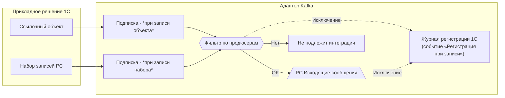
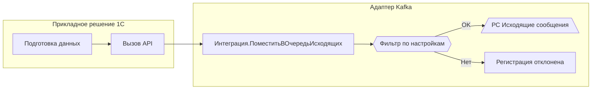
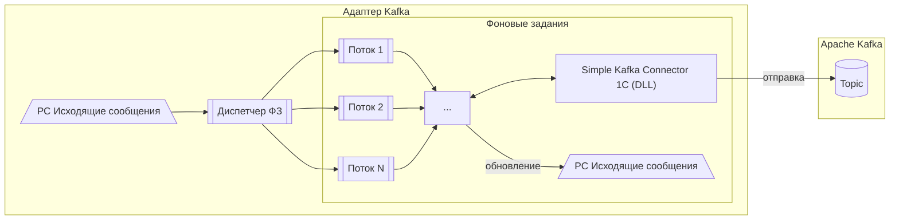
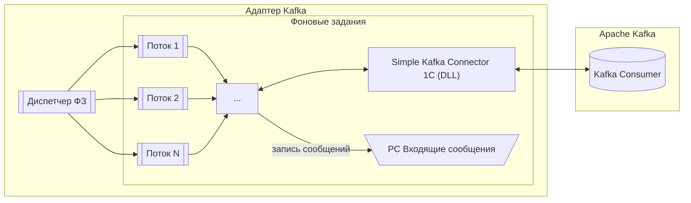
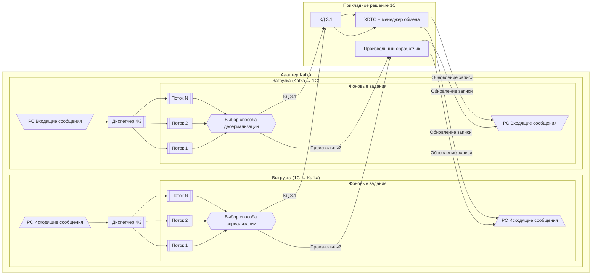

# Архитектура адаптера

## Назначение

Подсистема представляет собой **встраиваемую библиотеку** для прикладных решений на платформе **1С:Предприятие**, предназначенную для организации двустороннего событийного обмена сообщениями с брокером **[Apache Kafka](https://ru.wikipedia.org/wiki/Apache_Kafka)**.

Адаптер берёт на себя всю техническую часть интеграции:

- постановку данных в очереди;
- обработку, выгрузку и загрузку;
- контроль ошибок и логирование.

Прикладное решение использует адаптер как готовый инфраструктурный слой, не реализуя собственную логику работы с Kafka.

Подсистема может использоваться как:

- **инфраструктурный слой интеграции** — единый стандарт интеграции внутри прикладного решения;
- **транспорт для межсистемного обмена** — надёжный механизм доставки данных между системами;
- **механизм событийной синхронизации данных** — автоматическая публикация событий об изменениях данных.

---

## Логика работы и взаимодействие компонентов

### Регистрация изменений (1С → очередь)

Изменения данных в 1С автоматически или вручную регистрируются в очереди исходящих сообщений.

- Поддерживаются:
  - ссылочные объекты;
  - наборы записей регистров сведений (режим записи **Независимый**);
  - регистры, подчинённые регистратору (`РегистрНакопления`, `РегистрБухгалтерии`, `РегистрРасчёта`, `РегистрСведений` с режимом **ПодчинениеРегистратору**) — единицей регистрации является **регистратор** (документ), а не набор записей.

- Регистрация выполняется:
  - автоматически — через подписки на события записи;
  - вручную — через программный API адаптера.

Перед постановкой в очередь выполняется фильтрация по настройкам продюсеров.

Объекты, не подлежащие интеграции, отбрасываются на этапе фильтрации.

Ошибки, возникшие при автоматической регистрации, перехватываются: подробности записываются в журнал регистрации 1С (событие **«.Адаптер Kafka. Регистрация при записи»**), а операция записи объекта не прерывается — пользователь продолжает работу.

#### Автоматическая регистрация изменений

#### Ручная регистрация через API

### Выгрузка сообщений (1С → Kafka)

### Загрузка сообщений (Kafka → 1С)

### Сериализация/Десериализация

---

## Принципы

1. **Асинхронность** — все операции обмена выполняются асинхронно с использованием регистров сведений и фоновых заданий 1С.
2. **Надёжность и восстанавливаемость** — состояние обработки сообщений хранится в базе данных 1С, что позволяет безопасно переживать перезапуски и сбои.
3. **Масштабируемость** — обработка сообщений поддерживает параллельное выполнение в нескольких потоках.
4. **Конфигурируемость** — поведение интеграции управляется метаданными (справочники, константы и регистры сведений), без изменения кода.
5. **Расширяемость** — поддерживаются различные способы сериализации и бизнес‑обработки сообщений.

---

## Поток обработки исходящих сообщений (1С → Kafka)

Обработка исходящих сообщений выполняется асинхронно и разделена на **три независимых этапа**, управляемых отдельными потоками и диспетчерами: **сериализация**, **выгрузка** и **контроль дублей**.

### 1. Регистрация сообщения

Сообщение регистрируется в регистре **Исходящие сообщения** автоматически (через подписки) или вручную через API адаптера.

При ручной регистрации возможны два варианта:

- если передано готовое **тело сообщения**, этап сериализации пропускается;
- если переданы исходные данные, сообщение проходит этап сериализации для формирования тела сообщения.

### 2. Сериализация

**Диспетчер сериализации** отбирает сообщения, готовые к обработке, и распределяет их между потоками сериализации.

Потоки сериализации:

- преобразуют данные в формат, заданный настройками продюсера;
- формируют тело сообщения;
- обновляют состояние сообщения.

Сериализация может выполняться:

- произвольным обработчиком;
- через механизм **[1С:Конвертация данных 3.1](http://its.1c.ru/db/metod8dev#content:5846:hdoc)**.

Для регистров, подчинённых регистратору, при использовании КД 3.1 адаптер выполняет запрос всех записей по регистратору и применяет правила к каждой из них — результатом является **одно сообщение**, тело которого содержит массив объектов (**пакетная модель**). При использовании произвольного обработчика разработчик получает ссылку на регистратор и формирует тело сообщения самостоятельно.

### 3. Выгрузка в Kafka

**Диспетчер выгрузки** отбирает сериализованные сообщения и распределяет их между потоками выгрузки.

Потоки выгрузки:

- выполняют отправку тела сообщения в Kafka через внешний компонент **[Simple Kafka Connector 1C](https://github.com/NuclearAPK/Simple-Kafka_Adapter)**;
- обновляют состояние сообщения по результатам отправки.

### 4. Контроль и пометка дублей

Дополнительно выполняется отдельный поток контроля дублей.

Логика работы потока:

- для группы связанных сообщений определяется **последнее актуальное сообщение**;
- все предыдущие сообщения, которые **не были выгружены в Kafka**, помечаются состоянием **«Дубль»**;
- сообщения, помеченные как «Дубль», исключаются из дальнейшей сериализации и выгрузки.

Данный механизм позволяет:

- предотвращать отправку устаревших данных;
- снижать нагрузку на Kafka и внешние системы;
- обеспечивать доставку только актуального состояния данных.

**Автоматический повтор при ошибке выгрузки** — при статусе «Ошибка выгрузки» выполняется автоматический повтор отправки: не более **3 попыток**, с интервалом равным расписанию регламентного задания. Счётчик попыток хранится в поле «Количество выгрузок» записи РС. После исчерпания попыток, а также при ошибках сериализации, повторная обработка выполняется вручную администратором из РС «Исходящие сообщения».

---

## Поток обработки входящих сообщений (Kafka → 1С)

Обработка входящих сообщений выполняется асинхронно и разделена на **два независимых этапа**, управляемых отдельными диспетчерами: **загрузка** и **десериализация**.

### 1. Загрузка сообщений из Kafka

**Диспетчер загрузки** запускает один или несколько потоков загрузки.

Потоки загрузки:

- в непрерывном режиме ожидают поступления сообщений из Kafka;
- получают сообщения через внешний компонент **[Simple Kafka Connector 1C](https://github.com/NuclearAPK/Simple-Kafka_Adapter)**;
- сохраняют полученные сообщения в регистр **Входящие сообщения**;
- фиксируют начальное состояние сообщений для последующей обработки.

### 2. Десериализация и прикладная обработка

**Диспетчер десериализации** отбирает сообщения, готовые к обработке, и распределяет их между потоками десериализации.

Потоки десериализации:

- преобразуют тело сообщения в формат, ожидаемый прикладным решением;
- выполняют прикладную обработку сообщений;
- обновляют состояние сообщений по результатам обработки.

Обработка сообщений в прикладном решении может выполняться:

- произвольным обработчиком;
- через механизм **[1С:Конвертация данных 3.1](http://its.1c.ru/db/metod8dev#content:5846:hdoc)**.

**Автоматическая повторная обработка не выполняется** — повторная десериализация выполняется по решению администратора из РС «Входящие сообщения».

---

## Управление потоками

Максимальное количество потоков для этапов **сериализации**, **выгрузки**, **загрузки** и **десериализации** определяется в настройках **диспетчера задач**.

- минимальное количество потоков — **1**;
- при отсутствии нагрузки поток автоматически завершается;
- при появлении нагрузки диспетчер запускает необходимое количество потоков в пределах заданного максимума.

---

## Конфигурационные объекты (метаданные)

### Справочники

- **Брокеры** — параметры подключения к кластерам Kafka;
- **Продюсеры** — настройки публикации сообщений (топик, формат, сериализация);
- **Консьюмеры** — настройки загрузки сообщений (топик, формат, десериализация).

### Обработки

- **Интеграция** — высокоуровневый программный API адаптера;
- **Панель администрирования** — управление и мониторинг интеграции;
- **Регистрация изменений** — принудительная постановка данных в очередь.

### Регистры сведений

#### Очереди сообщений

- **Исходящие сообщения** — очередь сообщений для отправки из 1С в Kafka.
- **Входящие сообщения** — очередь сообщений, полученных из Kafka для обработки в 1С.

#### Служебные регистры

- **Очередь потоков** — используется диспетчером для распределения сообщений между потоками обработки.
- **Позиции операций** — хранит состояние обработки сообщений для различных фоновых операций.
- **Параметры очистки хранилища** — настройки автоматического удаления из очередей.
- **Параметры контроля интеграции** — настройки алертов и контрольных порогов.
- **Параметры логирования** — управление уровнем и направлениями логирования истории обмена.

### Программный интерфейс

- **Интеграция** — серверные методы подсистемы;
- **ИнтеграцияКлиент** — клиентские методы для вызова из прикладных решений.

---

## Зависимости

- **[Simple Kafka Connector 1C](https://github.com/NuclearAPK/Simple-Kafka_Adapter)** — внешний компонент для работы с Kafka;
- **[JSONEditor](https://github.com/josdejong/jsoneditor)** — UI‑редактор JSON;
- **[1С:Библиотека стандартных подсистем](https://v8.1c.ru/tekhnologii/standartnye-biblioteki/1s-biblioteka-standartnykh-podsistem)** — базовая инфраструктура.

---

## Примечания по эксплуатации

- Рекомендуется контролировать рост очередей.
- Для продуктивных контуров обязательны алерты и мониторинг задержек обработки.
- При высоких нагрузках рекомендуется увеличивать количество потоков обработки и разделять топики по типам данных.

Данная архитектура предназначена для использования в корпоративных и высоконагруженных интеграционных сценариях и может служить базой для построения единого событийного контура предприятия.

---

**Документация:** [Главная](index.md) · [Архитектура](architecture.md) · [Установка и подключение](setup.md) · [Настройка подсистемы](configuration.md) · [Руководство пользователя](usage.md) · [Примеры](examples.md) · [Эксплуатация](operations.md) · [Руководство разработчика](development.md) · [Глоссарий](glossary.md)
