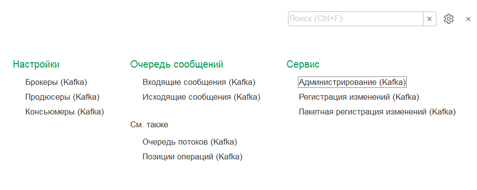
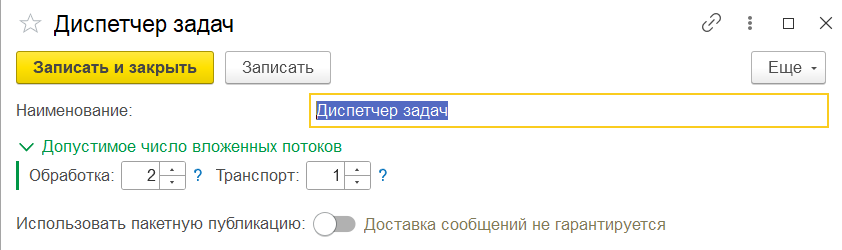
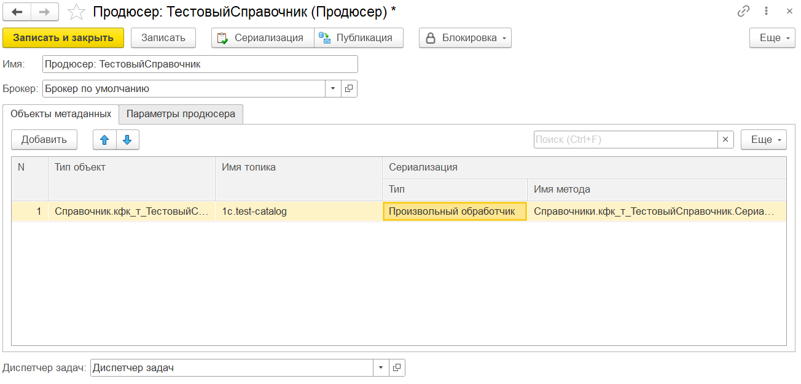
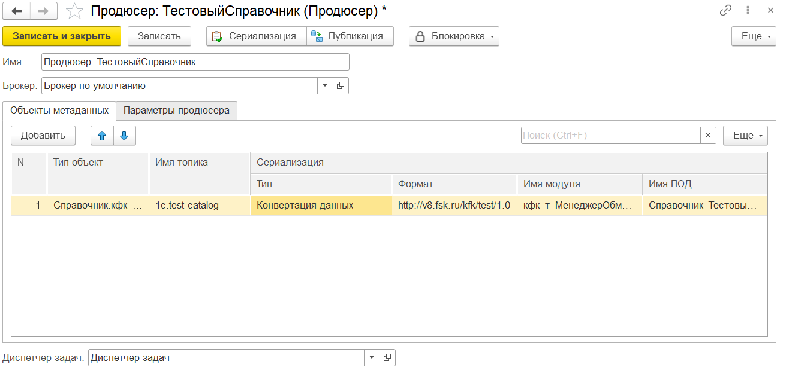
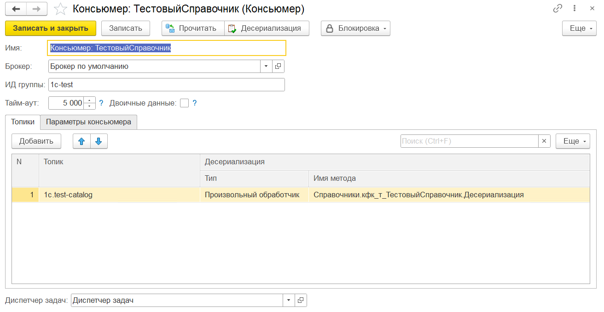
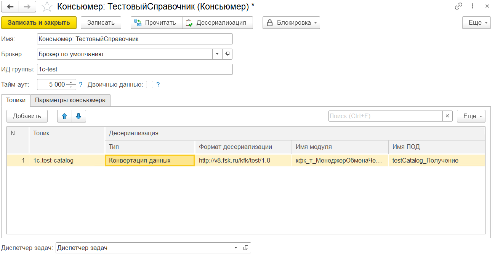
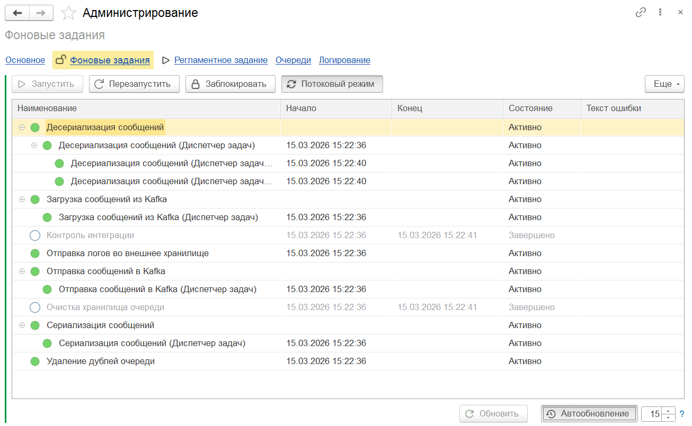
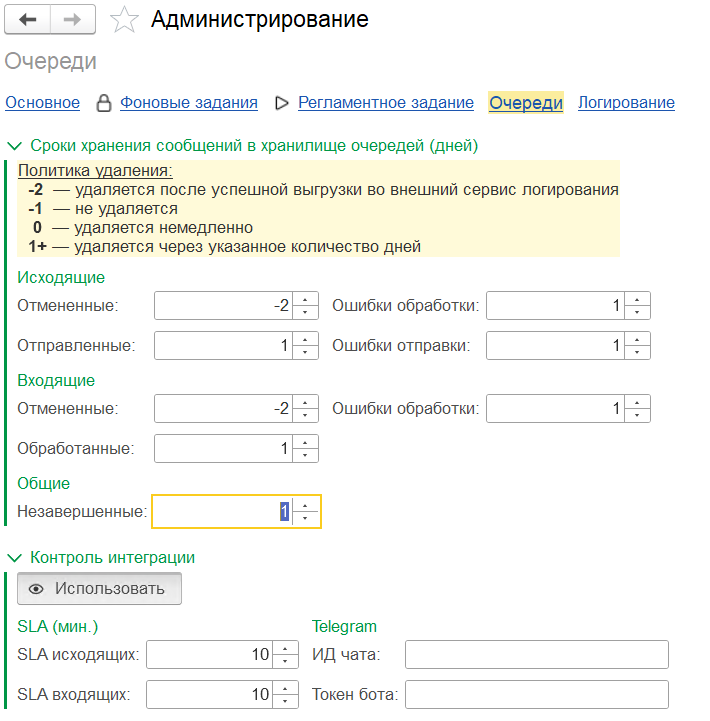
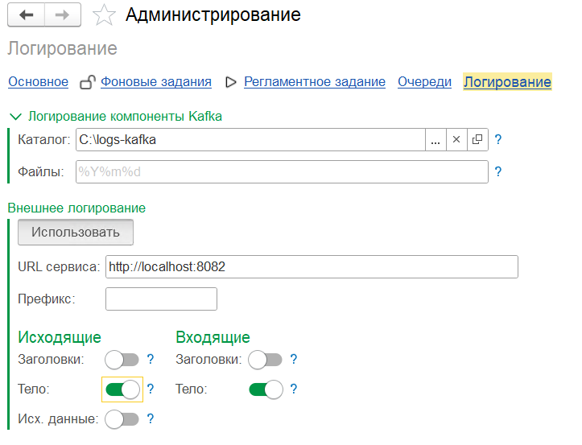

# Настройка подсистемы

Справочное руководство по настройке адаптера в режиме 1С:Предприятие. Выполняется после [установки и подключения](setup.md).

## Включение подсистемы

Откройте **Kafka / Администрирование** и нажмите **Включить подсистему**.

Для временной приостановки обмена без отключения подсистемы откройте **Kafka / Администрирование / Фоновые задания** и нажмите **Заблокировать**. Для возобновления — **Разблокировать**.

После включения подсистемы в меню **Kafka** становятся доступны следующие разделы:

| Раздел | Описание |
|--------|----------|
| **Настройки / Брокеры** | Управление подключениями к кластерам Kafka |
| **Настройки / Продюсеры** | Настройка отправки сообщений: объекты, топики, обработчики |
| **Настройки / Консьюмеры** | Настройка получения сообщений: топики, обработчики |
| **Очередь сообщений / Исходящие сообщения** | Просмотр очереди исходящих сообщений и их статусов |
| **Очередь сообщений / Входящие сообщения** | Просмотр очереди входящих сообщений и их статусов |
| **Сервис / Администрирование** | Управление подсистемой: включение, фоновые задания, мониторинг, логирование |
| **Сервис / Регистрация изменений** | Ручная регистрация объектов в очереди исходящих |
| **Сервис / Пакетная регистрация изменений** | Массовая регистрация объектов в очереди исходящих |

---

## Брокеры

Брокер (broker) — узел кластера Kafka, принимающий и хранящий сообщения. Один элемент справочника соответствует одному кластеру Kafka.

Откройте **Kafka / Брокеры** и создайте новый элемент.

**Команды:**

| Команда | Описание |
|---------|----------|
| **Блокировка / Публикация** | Временно останавливает отправку сообщений через этот брокер |
| **Блокировка / Чтения** | Временно останавливает получение сообщений через этот брокер |

**Поля:**

| Поле | Описание |
|------|----------|
| **Наименование** | Произвольное название для идентификации кластера |

**Узлы** — список узлов кластера (bootstrap-серверов):

| Поле | Описание |
|------|----------|
| *(признак)* | Включает/выключает узел |
| **Адрес** | Адрес узла в формате `host:port` |

**Параметры подключения** — дополнительные параметры [librdkafka](https://github.com/confluentinc/librdkafka) (SASL, SSL, тайм-ауты и др.):

| Поле | Описание |
|------|----------|
| **Ключ** | Название параметра (например, `security.protocol`) |
| **Значение** | Значение параметра |
| **Режим пароля** | Скрывает значение в форме — используется для паролей и токенов |

> Справочник параметров librdkafka: [CONFIGURATION.md](https://github.com/confluentinc/librdkafka/blob/master/CONFIGURATION.md)

---

## Продюсеры

Продюсер (producer) — отправитель сообщений в Kafka. Один элемент может обслуживать несколько топиков и типов объектов.

Справочник **Продюсеры** имеет двухуровневую структуру: **диспетчер задач** → **продюсеры**.

### Диспетчер задач

Группа продюсеров, отвечающая за распределение нагрузки между подпотоками.

| Поле | Описание |
|------|----------|
| **Наименование** | Произвольное название диспетчера |
| **Подпотоки обработки** | Количество параллельных потоков сериализации |
| **Подпотоки транспорта** | Количество параллельных потоков отправки в Kafka |
| **Использовать пакетную публикацию** | Отправка нескольких сообщений одним пакетом |

### Продюсер

**Команды:**

| Команда | Описание |
|---------|----------|
| **Блокировка / Регистрации** | Останавливает постановку новых объектов в очередь |
| **Блокировка / Сериализации** | Останавливает сериализацию объектов из очереди |
| **Блокировка / Публикации** | Останавливает отправку сериализованных сообщений в Kafka |

**Поля:**

| Поле | Описание |
|------|----------|
| **Наименование** | Произвольное название продюсера |
| **Брокер** | Брокер Kafka, через который отправляются сообщения |

**Объекты метаданных** — какие объекты отправляются и как:

| Поле | Описание |
|------|----------|
| **Тип объект** | Имя типа метаданных 1С (например, `Документ.РеализацияТоваровУслуг`, `РегистрНакопления.ТоварыНаСкладах`) или произвольный ключ, передаваемый в параметр `ТипОбъект` метода `кфкИнтеграция.ПоместитьВОчередьИсходящих()`. Для регистров, подчинённых регистратору, указывается имя регистра — при записи в очередь будет помещён регистратор. |
| **Имя топика** | Топик Kafka, в который публикуются сообщения этого типа |
| **Тип сериализации** | Способ преобразования данных: **Конвертация данных** или **Произвольный обработчик** |
| **Имя метода сериализации** | Для типа «Произвольный обработчик» — имя экспортного метода |
| **Имя модуля сериализации** | Для типа «Произвольный обработчик» — имя общего модуля |
| **Имя ПОД сериализации** | Для типа «Конвертация данных» — имя правил обработки данных из модуля обмена КД 3.1 |
| **Формат сериализации** | URL пространства имён XDTO-пакета |

> При открытии формы продюсера список доступных топиков автоматически запрашивается из брокера Kafka через Admin API и становится доступен для выбора и автодополнения в поле **Имя топика**. При смене брокера список обновляется. Системные внутренние топики Kafka в список не включаются.

**Параметры продюсера** — дополнительные параметры [librdkafka](https://github.com/confluentinc/librdkafka):

| Поле | Описание |
|------|----------|
| **Ключ** | Название параметра |
| **Значение** | Значение параметра |

---

## Консьюмеры

Консьюмер (consumer) — получатель сообщений из Kafka.

Справочник **Консьюмеры** имеет двухуровневую структуру: **диспетчер задач** → **консьюмеры**.

### Диспетчер задач

Создаётся отдельной кнопкой в списке.

| Поле | Описание |
|------|----------|
| **Наименование** | Произвольное название диспетчера |
| **Подпотоки обработки** | Количество параллельных потоков десериализации |
| **Подпотоки транспорта** | Количество параллельных потоков чтения из Kafka |

### Консьюмер

**Команды:**

| Команда | Описание |
|---------|----------|
| **Блокировка / Чтения** | Останавливает получение новых сообщений из Kafka |
| **Блокировка / Десериализации** | Останавливает обработку полученных сообщений |

**Поля:**

| Поле | Описание |
|------|----------|
| **Наименование** | Произвольное название консьюмера |
| **Брокер** | Брокер Kafka, из которого читаются сообщения |
| **Идентификатор** | Идентификатор группы консьюмеров (consumer group id) — все консьюмеры с одним идентификатором получают разные сообщения из топика |
| **Тайм-аут ожидания** | Время ожидания сообщений от брокера в миллисекундах |
| **Двоичные данные** | Получать тело сообщения как двоичные данные (не преобразовывать в строку) |

**Топики** — из каких топиков читать и как обрабатывать:

| Поле | Описание |
|------|----------|
| **Топик** | Имя топика Kafka, из которого читаются сообщения |
| **Тип десериализации** | Способ обработки: **Конвертация данных** или **Произвольный обработчик** |
| **Имя метода десериализации** | Для типа «Произвольный обработчик» — имя экспортного метода |
| **Имя модуля десериализации** | Для типа «Произвольный обработчик» — имя общего модуля |
| **Имя ПОД десериализации** | Для типа «Конвертация данных» — имя правил обработки данных из модуля обмена КД 3.1 |
| **Формат десериализации** | URL пространства имён XDTO-пакета |

> При открытии формы консьюмера список доступных топиков автоматически запрашивается из брокера Kafka через Admin API и становится доступен для выбора и автодополнения в поле **Топик**. При смене брокера список обновляется. Системные внутренние топики Kafka в список не включаются.

**Параметры консьюмера** — дополнительные параметры [librdkafka](https://github.com/confluentinc/librdkafka):

| Поле | Описание |
|------|----------|
| **Ключ** | Название параметра |
| **Значение** | Значение параметра |

---

## Фоновые и регламентные задания

Откройте **Kafka / Администрирование / Фоновые задания**.

Откройте **Kafka / Администрирование / Регламентное задание** и активируйте задание `Использовать`. Там же задаётся расписание запуска и пользователь обмена.

При необходимости включите **Использовать потоковый режим** — в этом режиме фоновые задания (сериализация, десериализация, выгрузка, загрузка) не завершаются после обработки очереди, а остаются активными и ждут появления новых данных. При отсутствии нагрузки потоки автоматически завершаются через 5 минут.

---

## Алерты и логирование

### Сроки хранения и контроль интеграции

Откройте **Kafka / Администрирование / Очереди**.

**Сроки хранения сообщений** — задаются раздельно для каждого статуса исходящих и входящих сообщений:

| Значение | Поведение |
|----------|-----------|
| `-2` | Удалять после выгрузки в сервис логирования |
| `-1` | Не удалять |
| `0` | Удалять немедленно |
| `N` | Удалять через N дней |

**Контроль интеграции** — доступен только если срок хранения всех статусов, кроме «Отменённые», составляет 1 день и более:

| Поле / кнопка | Описание |
|---------------|----------|
| **Использовать** | Включает/выключает контроль интеграции |
| **SLA исходящих** | Допустимое время обработки исходящих сообщений (мин.) |
| **SLA входящих** | Допустимое время обработки входящих сообщений (мин.) |
| **Окно анализа** | Период, за который проверяются нарушения SLA (мин.) |
| **ИД чата** | Идентификатор чата Telegram для алертов |
| **Токен бота** | Токен Telegram-бота |

### Логирование

Откройте **Kafka / Администрирование / Логирование**.

**Логирование компоненты Kafka:**

| Поле | Описание |
|------|----------|
| **Каталог** | Путь на сервере для лог-файлов внешней компоненты |
| **Файлы** | Шаблон имени лог-файла |

**Внешнее логирование** — выгрузка журнала обмена в HTTP/HTTPS-эндпоинт ([Logstash](https://www.elastic.co/logstash), Elasticsearch, Loki и др.):

| Поле / кнопка | Описание |
|---------------|----------|
| **Использовать** | Включает/выключает выгрузку |
| **URL сервиса** | Адрес эндпоинта (например, `https://hostname:8080/my-logs`) |
| **Префикс** | Префикс, добавляемый к записям журнала |
| **Исходящие** — Заголовки / Тело / Исх. данные | Что выгружать по исходящим сообщениям |
| **Входящие** — Заголовки / Тело | Что выгружать по входящим сообщениям |

---

**Документация:** [Главная](index.md) · [Архитектура](architecture.md) · [Установка и подключение](setup.md) · [Настройка подсистемы](configuration.md) · [Руководство пользователя](usage.md) · [Примеры](examples.md) · [Эксплуатация](operations.md) · [Руководство разработчика](development.md) · [Глоссарий](glossary.md)
