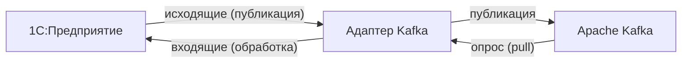

---
hide:
  - navigation
  - toc
---

# 1С: Адаптер Kafka

**Встраиваемая подсистема для организации двустороннего событийного обмена сообщениями между 1С:Предприятие и [Apache Kafka](https://ru.wikipedia.org/wiki/Apache_Kafka).** Построена на базе внешнего компонента [Simple Kafka Connector 1C](https://github.com/NuclearAPK/Simple-Kafka_Adapter).

## С чего начать

-   :material-book-open-variant:{ .lg } **Обзор**

    ---

    Понять идею, архитектуру и поток данных — если вы впервые слышите об адаптере.

    [:octicons-arrow-right-24: Читать обзор](overview/index.md)

-   :material-account-cog:{ .lg } **Пользователю**

    ---

    Установка, настройка, программный API, примеры, мониторинг и эксплуатация.

    [:octicons-arrow-right-24: Руководство пользователя](user/index.md)

-   :material-code-braces:{ .lg } **Разработка проекта**

    ---

    Для тех, кто развивает саму подсистему: окружение, модули, метаданные, расширение.

    [:octicons-arrow-right-24: Руководство разработчика](project/index.md)

-   :material-book-alphabet:{ .lg } **Глоссарий**

    ---

    Термины Apache Kafka для 1С-специалистов.

    [:octicons-arrow-right-24: К глоссарию](glossary.md)

## Быстрый старт

!!! tip "Предварительное условие"
    Доступный кластер Apache Kafka (`host:port`).

1. **[Подключите адаптер](user/installation/index.md)** к прикладной конфигурации — как расширение или как часть основной конфигурации.
2. **Включите интеграцию** — откройте **Kafka / Администрирование** и нажмите **Включить подсистему**.
3. **[Настройте брокер](user/configuration/brokers.md)** — создайте элемент и укажите адрес bootstrap-сервера.
4. **Создайте [продюсер](user/configuration/producers.md) и/или [консьюмер](user/configuration/consumers.md)** — задайте топик и способ обработки сообщений.
5. **[Активируйте регламентное задание](user/configuration/jobs.md)** — откройте **Kafka / Администрирование / Регламентное задание** и включите его.
6. **Проверьте обмен** — отправьте или получите сообщение и убедитесь, что обмен прошёл успешно.

## Что умеет адаптер

=== "Регистрация и отправка"

    - Автоматическая постановка объектов и наборов записей в очередь при записи
    - Ручная регистрация через UI или программный API
    - Формирование сообщений произвольными обработчиками или через [1С:Конвертация данных 3.1](http://its.1c.ru/db/metod8dev#content:5846:hdoc)
    - Сериализация и валидация исходящих сообщений на основе [XDTO](https://v8.1c.ru/platforma/xdto/)
    - Параллельная отправка через фоновые задания 1С

=== "Получение и обработка"

    - Автоматическая загрузка сообщений из Kafka
    - Обработка произвольными обработчиками или через 1С:Конвертация данных 3.1
    - Десериализация и валидация входящих сообщений на основе XDTO
    - Параллельная обработка через фоновые задания 1С

=== "API"

    - Высокоуровневый API, абстрагирующий работу с Kafka и внешним компонентом
    - Прямой (синхронный) API для нестандартных сценариев

=== "Мониторинг"

    - Хранение истории обмена и диагностической информации
    - Алерты с уведомлениями в Telegram
    - Выгрузка журнала обмена в Elasticsearch / Logstash / Kibana

## Лицензия

Проект распространяется под лицензией [Mozilla Public License 2.0 (MPL-2.0)](https://github.com/ShadobaAI/kafka-adapter/blob/main/LICENSE). Разрешено использование, модификация и распространение — в том числе в коммерческих проектах. Изменения в файлах под MPL-2.0 должны оставаться открытыми.
