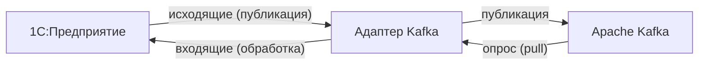

# 1С: Адаптер Kafka

Подсистема интеграции 1С:Предприятие с [Apache Kafka](https://ru.wikipedia.org/wiki/Apache_Kafka) на основе внешнего компонента [Simple Kafka Connector 1C](https://github.com/NuclearAPK/Simple-Kafka_Adapter), созданная на базе проекта [Kafka1CExtension](https://github.com/NuclearAPK/Kafka1CExtension).

## О проекте

**1С: Адаптер Kafka** — встраиваемая подсистема для построения надёжных, масштабируемых и управляемых интеграционных потоков между 1С:Предприятие и брокером сообщений [Apache Kafka](https://ru.wikipedia.org/wiki/Apache_Kafka) на основе событийной архитектуры.

### Возможности

**Регистрация и отправка данных (1С → Kafka)**

- Автоматическая постановка объектов и наборов записей в очередь при записи
- Ручная регистрация через пользовательский интерфейс или программный API
- Формирование сообщений произвольными обработчиками или через [1С:Конвертация данных 3.1](http://its.1c.ru/db/metod8dev#content:5846:hdoc)
- Сериализация и валидация исходящих сообщений на основе [XDTO](https://v8.1c.ru/platforma/xdto/)
- Параллельная отправка сообщений через фоновые задания 1С

**Получение и обработка данных (Kafka → 1С)**

- Автоматическая загрузка сообщений из Kafka
- Обработка произвольными обработчиками или через [1С:Конвертация данных 3.1](http://its.1c.ru/db/metod8dev#content:5846:hdoc)
- Десериализация и валидация входящих сообщений на основе [XDTO](https://v8.1c.ru/platforma/xdto/)
- Параллельная обработка входящих сообщений через фоновые задания 1С

**Интеграция и API**

- Высокоуровневый API, абстрагирующий работу с Kafka и внешним компонентом [Simple Kafka Connector 1C](https://github.com/NuclearAPK/Simple-Kafka_Adapter)

**Мониторинг и операционность**

- Хранение истории обмена и диагностической информации
- Алерты с уведомлениями в Telegram
- Выгрузка журнала обмена в Elasticsearch / Logstash / Kibana

## С чего начать

=== "Настраиваю впервые"
    1. [Архитектура](architecture.md) — понять, как устроен адаптер и как работает обмен
    2. [Установка и подключение](setup.md) — добавить подсистему в конфигурацию
    3. [Настройка подсистемы](configuration.md) — создать брокер, продюсер, консьюмер
    4. [Примеры](examples.md) — готовые рецепты для типовых задач

=== "Пишу обработчики"
    1. [Руководство пользователя](usage.md) — API и контракты обработчиков
    2. [Примеры](examples.md) — шаблоны для сериализации, десериализации, прямого API

=== "Диагностирую проблему"
    1. [Эксплуатация](operations.md) — статусы сообщений, типовые проблемы и решения
    2. [Настройка подсистемы](configuration.md#алерты-и-логирование) — алерты и логирование

=== "Разрабатываю адаптер"
    1. [Руководство разработчика](development.md) — среда разработки, архитектура модулей
    2. [Архитектура](architecture.md) — принципы работы и компоненты

## Быстрый старт

> **Предварительное условие:** доступный кластер Apache Kafka (`host:port`).

1. **Подключите адаптер** к прикладной конфигурации — как расширение конфигурации или как часть основной конфигурации.

2. **Включите интеграцию** — откройте **Kafka / Администрирование** и нажмите кнопку **Включить подсистему**.

3. **Настройте [брокер](glossary.md#брокер-broker)** — создайте элемент в справочнике **Брокеры** и укажите адрес [bootstrap-сервера](glossary.md#bootstrap-серверы-bootstrap-servers) (`host:port`).

4. **Создайте [продюсер](glossary.md#продюсер-producer) и/или [консьюмер](glossary.md#консьюмер-consumer)** — задайте [топик](glossary.md#топик-topic) и способ обработки сообщений.

5. **Активируйте регламентное задание** — откройте **Kafka / Администрирование / Регламентное задание** и включите его.

6. **Проверьте обмен** — отправьте сообщение в Kafka и/или получите сообщение из Kafka; убедитесь, что обмен прошёл успешно.

Подробное описание — в [Установка и подключение](setup.md) и [Настройка подсистемы](configuration.md).

## Варианты внедрения

| | Расширение конфигурации | Часть основной конфигурации |
|---|---|---|
| **Рекомендуется для** | Типовых конфигураций с регулярными обновлениями | Глубоко кастомизированных решений |
| **Плюсы** | Минимальное вмешательство в основную конфигурацию; простое отключение и удаление | Полный контроль над точками встраивания; глубокая интеграция в прикладную логику |
| **Минусы** | Ограничения механизма расширений 1С | Сложность обновления зависит от режима поддержки |

Детальное описание обоих вариантов — в [Установка и подключение](setup.md).

## Ограничения и особенности

- **Автоматический повтор при ошибке выгрузки.** Если сообщение не удалось доставить в Kafka (`ОшибкаВыгрузки`), система автоматически повторяет попытку отправки — не более **3 раз**, с интервалом равным расписанию регламентного задания. После исчерпания попыток сообщение требует ручного вмешательства. Ошибки сериализации и десериализации (`ОшибкаОбработки`) автоматически не повторяются.

- **Дедупликация исходящих.** Если объект изменился несколько раз до выгрузки, в Kafka отправляется только последнее состояние. Промежуточные версии помечаются как «Дубль» и исключаются из обработки. Полная история изменений в Kafka не сохраняется.

- **Только клиент-серверная ИБ.** Файловый режим работы не поддерживается.

- **Ограничения на размер сообщения.** Табличные части объекта — до ~100 000 строк; итоговый размер сообщения — до ~10 МБ.

- **[Дополнительные индексы](https://its.1c.ru/db/v8std/content/791/hdoc).** При внедрении как расширения конфигурации индексы [создаются в СУБД вручную](https://its.1c.ru/db/v8326doc#bookmark:dev:TI000002802). При внедрении в основную конфигурацию с лицензией «КОРП» — создаются автоматически.

## Системные требования

- **Платформа**: 1С:Предприятие 8.3.21 и выше (для Linux — 8.3.24 и выше)
- **ОС**: Windows 64-bit / Linux 64-bit
- **Библиотеки**: 1С:Библиотека стандартных подсистем 3.1.10 и выше
- **Инфраструктура**: доступный [кластер](glossary.md#кластер-cluster) Apache Kafka
- **Лицензия**: «ПРОФ» и выше

Подробные требования к среде развёртывания описаны в [Установка и подключение](setup.md).

## Благодарности

**Компоненты и библиотеки:**

- **[Simple Kafka Connector 1C](https://github.com/NuclearAPK/Simple-Kafka_Adapter)** — внешний компонент (DLL) для работы с Apache Kafka из 1С:Предприятие, построенный на базе [librdkafka](https://github.com/confluentinc/librdkafka).
- **[JSONEditor](https://github.com/josdejong/jsoneditor)** — встроенный UI-редактор JSON.

**Инструменты разработки:**

- **[RDT1C](https://github.com/tormozit/RDT1C)** — подсистема «Инструменты разработчика» для платформы 1С:Предприятие 8.
- **[tools_ui_1c](https://github.com/cpr1c/tools_ui_1c)** — универсальные инструменты для управляемых форм 1С.

**Тестирование:**

- **[YAxUnit](https://github.com/bia-technologies/yaxunit)** — фреймворк для юнит-тестирования на платформе 1С:Предприятие.

**Инфраструктура:**

- **[onec-docker](https://github.com/jugatsu/onec-docker)** — использовался как пример при создании Docker-образов для CI/CD workflows.

---

## Лицензия

Проект распространяется под лицензией [Mozilla Public License 2.0 (MPL-2.0)](https://github.com/ShadobaAI/kafka-adapter/blob/main/LICENSE).

**Разрешается:** использование, модификация и распространение — в том числе в коммерческих проектах.

**Условие:** изменения в файлах, распространяемых под MPL-2.0, должны быть открыты на тех же условиях.

## Участие в разработке

Приветствуются предложения, сообщения об ошибках и pull request'ы.

**При создании issue:**

- для ошибки — укажите версию платформы 1С, описание проблемы и шаги воспроизведения;
- для предложения — опишите задачу и ожидаемое поведение;
- для вопроса — постарайтесь предоставить минимальный воспроизводимый пример.

**При создании pull request'а:**

- опишите суть изменения и мотивацию;
- убедитесь, что изменения не нарушают работу существующей функциональности;
- для значительных изменений — сначала откройте issue для обсуждения.
