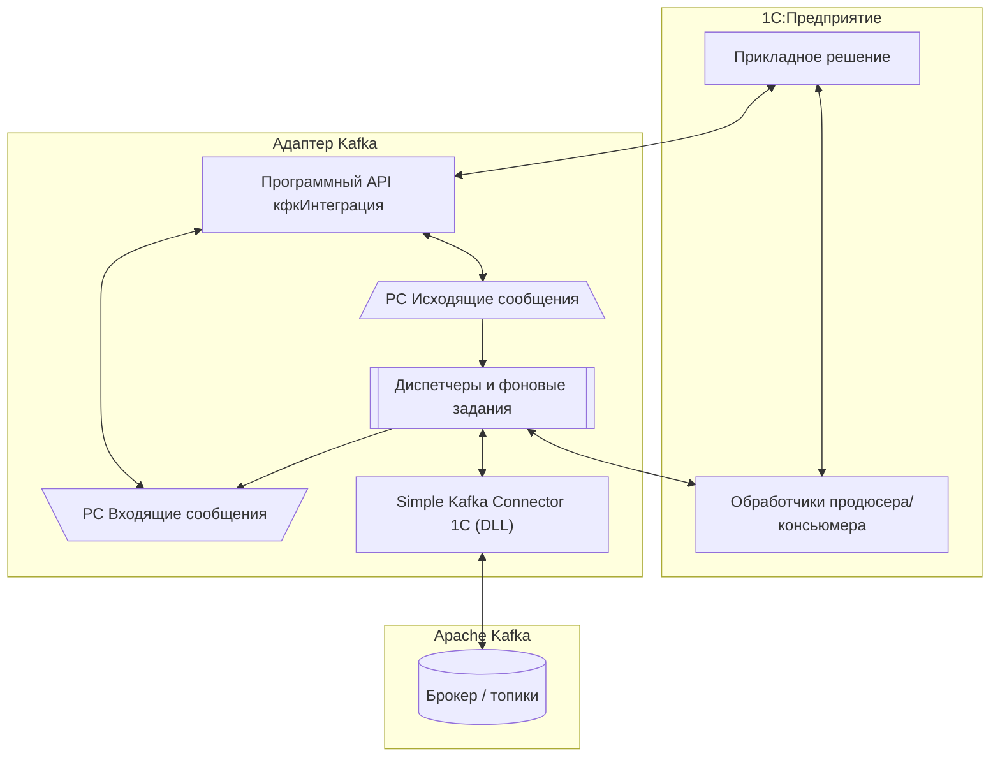

# Архитектура

## Назначение

Подсистема — **встраиваемая библиотека** для прикладных решений на платформе 1С:Предприятие, предназначенная для организации двустороннего событийного обмена сообщениями с брокером [Apache Kafka](https://ru.wikipedia.org/wiki/Apache_Kafka).

Адаптер берёт на себя всю техническую часть интеграции, прикладное решение использует его как готовый инфраструктурный слой.

## Общая схема

## Ключевые компоненты

### Программный API `кфкИнтеграция`

Точка входа для прикладного кода: регистрация сообщений, прямая отправка, чтение.

### Регистры-очереди

- **Исходящие сообщения** — очередь сообщений для отправки из 1С в Kafka.
- **Входящие сообщения** — очередь сообщений, полученных из Kafka.

### Диспетчеры и фоновые задания

Независимые потоки для:

- **сериализации** исходящих сообщений;
- **выгрузки** сериализованных сообщений в Kafka;
- **загрузки** сообщений из Kafka;
- **десериализации** и прикладной обработки входящих сообщений;
- **контроля дублей** — пометка устаревших версий исходящих сообщений.

Количество потоков каждого типа настраивается в диспетчере задач продюсера/консьюмера.

### Внешний компонент

[Simple Kafka Connector 1C](https://github.com/NuclearAPK/Simple-Kafka_Adapter) — DLL-компонент, построенный на [librdkafka](https://github.com/confluentinc/librdkafka). Все низкоуровневые операции с Kafka выполняет он. Компонент встроен в подсистему, отдельная установка не требуется.

### Обработчики прикладного решения

Функции/процедуры, которые получают объект 1С и формируют тело сообщения (продюсер) или получают тело сообщения и записывают данные в 1С (консьюмер). Поддерживаются:

- **произвольные обработчики** — экспортные методы общих модулей;
- **обработчики через [1С:Конвертация данных 3.1](http://its.1c.ru/db/metod8dev#content:5846:hdoc)** — правила КД + XDTO-пакет.

## Конфигурационные объекты

### Справочники

- **Брокеры** — параметры подключения к кластерам Kafka.
- **Продюсеры** — настройки публикации сообщений (топик, формат, сериализация).
- **Консьюмеры** — настройки загрузки сообщений (топик, формат, десериализация).

### Обработки

- **Интеграция** — высокоуровневый программный API адаптера.
- **Панель администрирования** — управление и мониторинг.
- **Регистрация изменений** — принудительная постановка данных в очередь.

### Регистры сведений

**Очереди сообщений:**

- **Исходящие сообщения** — очередь для отправки в Kafka.
- **Входящие сообщения** — очередь для обработки в 1С.

**Служебные:**

- **Очередь потоков** — распределение сообщений между потоками обработки.
- **Позиции операций** — состояние обработки сообщений для фоновых операций.
- **Параметры очистки хранилища** — настройки автоматического удаления.
- **Параметры контроля интеграции** — настройки алертов и порогов.
- **Параметры логирования** — уровни и направления логирования.

Полный перечень метаданных — в разделе [Объекты метаданных](../project/metadata.md).

## Зависимости

| Компонент | Роль |
|-----------|------|
| [Simple Kafka Connector 1C](https://github.com/NuclearAPK/Simple-Kafka_Adapter) | Внешний компонент для работы с Kafka |
| [JSONEditor](https://github.com/josdejong/jsoneditor) | UI‑редактор JSON |
| [1С:Библиотека стандартных подсистем](https://v8.1c.ru/tekhnologii/standartnye-biblioteki/1s-biblioteka-standartnykh-podsistem) | Базовая инфраструктура |

---

Как устроены **потоки данных** — в разделе [Потоки данных](data-flow.md). **Принципы** работы и ограничения — в [Принципы и ограничения](principles.md).
