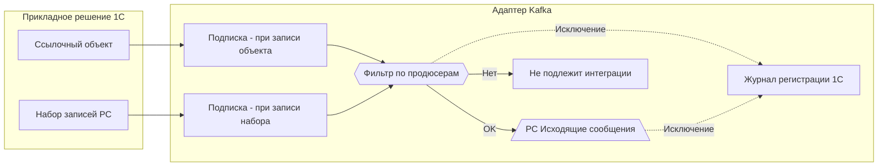
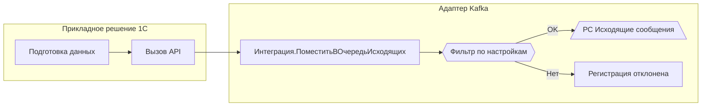
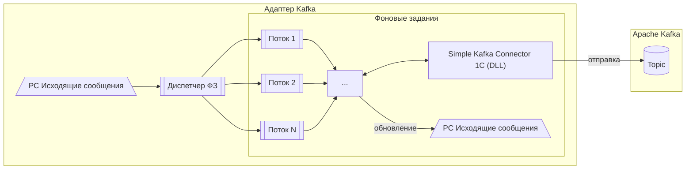
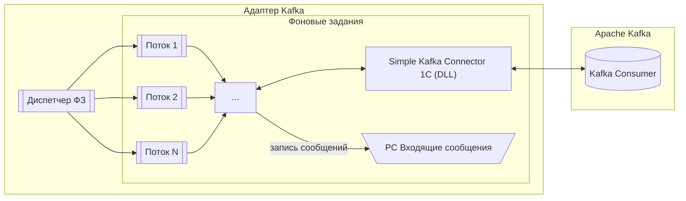
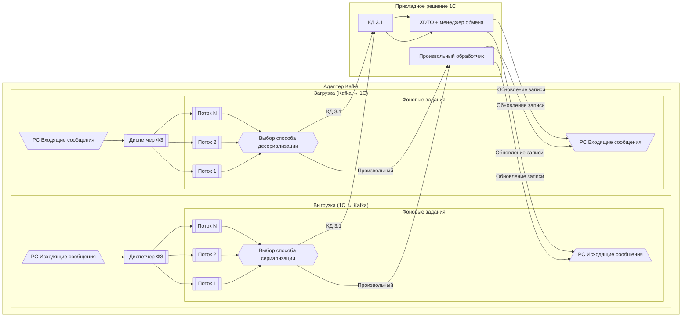

# Потоки данных

Детальное описание того, как данные движутся через адаптер — от записи объекта в 1С до попадания в Kafka и обратно.

## Исходящие сообщения (1С → Kafka)

Обработка исходящих сообщений выполняется асинхронно и разделена на **три независимых этапа**, управляемых отдельными диспетчерами: **регистрация**, **сериализация**, **выгрузка**. Дополнительный поток — **контроль дублей**.

### 1. Регистрация

Изменения данных в 1С автоматически или вручную регистрируются в регистре «Исходящие сообщения».

**Поддерживаются:**

- ссылочные объекты;
- наборы записей регистров сведений (режим записи **Независимый**);
- регистры, подчинённые регистратору (`РегистрНакопления`, `РегистрБухгалтерии`, `РегистрРасчёта`, `РегистрСведений` с режимом **ПодчинениеРегистратору**) — единицей регистрации является **регистратор** (документ), а не набор записей.

**Регистрация выполняется:**

- автоматически — через подписки на события записи;
- вручную — через программный API адаптера.

Перед постановкой в очередь выполняется фильтрация по настройкам продюсеров. Объекты, не подлежащие интеграции, отбрасываются на этапе фильтрации.

Ошибки при автоматической регистрации перехватываются: подробности записываются в журнал регистрации 1С (событие **«.Адаптер Kafka. Регистрация при записи»**), а операция записи объекта **не прерывается** — пользователь продолжает работу.

#### Автоматическая регистрация через подписки

#### Ручная регистрация через API

При ручной регистрации возможны два варианта:

- если передано **готовое тело сообщения**, этап сериализации пропускается;
- если переданы **исходные данные**, сообщение проходит этап сериализации.

### 2. Сериализация

**Диспетчер сериализации** отбирает сообщения, готовые к обработке, и распределяет их между потоками сериализации.

Потоки сериализации:

- преобразуют данные в формат, заданный настройками продюсера;
- формируют тело сообщения;
- обновляют состояние сообщения.

Сериализация может выполняться:

- произвольным обработчиком прикладного решения;
- через механизм [1С:Конвертация данных 3.1](http://its.1c.ru/db/metod8dev#content:5846:hdoc).

!!! info "Регистры по регистратору"
    При использовании КД 3.1 адаптер выполняет запрос всех записей по регистратору и применяет правила к каждой из них. Результат — **одно сообщение**, тело которого содержит массив объектов (**пакетная модель**). При использовании произвольного обработчика разработчик получает ссылку на регистратор и формирует тело сообщения самостоятельно.

### 3. Выгрузка в Kafka

**Диспетчер выгрузки** отбирает сериализованные сообщения и распределяет их между потоками выгрузки.

Потоки выгрузки:

- выполняют отправку тела сообщения в Kafka через внешний компонент;
- обновляют состояние сообщения по результатам отправки.

!!! warning "Автоматический повтор"
    При статусе «Ошибка выгрузки» выполняется автоматический повтор отправки: не более **3 попыток**, с интервалом равным расписанию регламентного задания. Счётчик попыток хранится в поле «Количество выгрузок» записи РС. После исчерпания попыток (а также при статусе «Ошибка обработки») повторная обработка запускается **вручную** администратором из РС «Исходящие сообщения».

### 4. Контроль дублей

Отдельный поток контроля дублей:

- для группы связанных сообщений определяет **последнее актуальное сообщение**;
- все предыдущие сообщения, которые **не были выгружены в Kafka**, помечаются состоянием **«Дубль»**;
- сообщения, помеченные как «Дубль», **исключаются** из дальнейшей сериализации и выгрузки.

Это позволяет:

- предотвращать отправку устаревших данных;
- снижать нагрузку на Kafka и внешние системы;
- обеспечивать доставку только актуального состояния данных.

---

## Входящие сообщения (Kafka → 1С)

Обработка входящих сообщений выполняется асинхронно и разделена на **два независимых этапа**: **загрузка** и **десериализация**.

### 1. Загрузка из Kafka

**Диспетчер загрузки** запускает один или несколько потоков загрузки.

Потоки загрузки:

- в непрерывном режиме ожидают поступления сообщений из Kafka;
- получают сообщения через внешний компонент;
- сохраняют полученные сообщения в регистр «Входящие сообщения»;
- фиксируют начальное состояние сообщений для последующей обработки.

### 2. Десериализация и прикладная обработка

**Диспетчер десериализации** отбирает сообщения, готовые к обработке, и распределяет их между потоками десериализации.

Потоки десериализации:

- преобразуют тело сообщения в формат, ожидаемый прикладным решением;
- выполняют прикладную обработку сообщений;
- обновляют состояние сообщений по результатам обработки.

Обработка может выполняться:

- произвольным обработчиком прикладного решения;
- через механизм 1С:Конвертация данных 3.1.

!!! warning "Автоповтор не выполняется"
    Повторная десериализация выполняется **вручную** — по решению администратора из РС «Входящие сообщения».

---

## Сериализация и десериализация

Единая схема выбора способа преобразования данных:

## Управление потоками

Максимальное количество потоков для этапов **сериализации**, **выгрузки**, **загрузки** и **десериализации** определяется в настройках **диспетчера задач**.

- минимальное количество потоков — **1**;
- при отсутствии нагрузки поток автоматически завершается;
- при появлении нагрузки диспетчер запускает необходимое количество потоков в пределах заданного максимума.

Настройка — см. [Продюсеры](../user/configuration/producers.md) и [Консьюмеры](../user/configuration/consumers.md).
