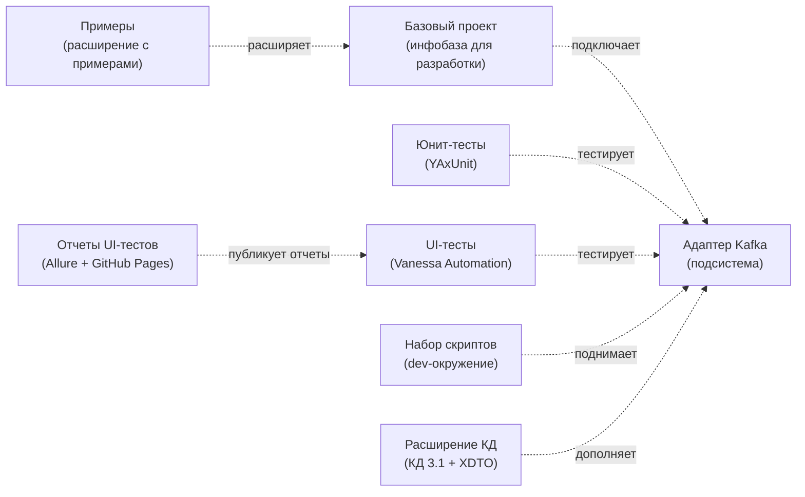

# Репозитории

Проект состоит из нескольких репозиториев — у каждого своя роль.

| Репозиторий | Назначение |
|-------------|-----------|
| [**Адаптер Kafka**](https://github.com/ShadobaAI/kafka-adapter) | Исходный код подсистемы (этот репозиторий) |
| [**Базовый проект**](https://github.com/ShadobaAI/kafka-adapter-base) | Конфигурация базы данных — базовая конфигурация для разработки |
| [**Примеры**](https://github.com/ShadobaAI/kafka-adapter-examples) | Тестовое расширение: примеры использования API и отладка интеграции |
| [**Юнит-тесты**](https://github.com/ShadobaAI/kafka-adapter-tests-unit) | Юнит-тесты адаптера Kafka: YAxUnit |
| [**UI-тесты**](https://github.com/ShadobaAI/kafka-adapter-tests-ui) | UI-тесты адаптера Kafka: Vanessa Automation |
| [**Отчеты тестов**](https://github.com/ShadobaAI/kafka-adapter-tests-reports) | Опубликованные Allure HTML-отчеты тестов |
| [**Набор скриптов**](https://github.com/ShadobaAI/kafka-tools) | Скрипты для развёртывания среды разработки |
| [**Расширение КД**](https://github.com/ShadobaAI/kafka-adapter-conv) | Расширение для КД 3.1.6+, адаптирующее типовую конвертацию данных под произвольный XDTO |
| [**Трекер задач**](https://github.com/ShadobaAI/kfk-tasks) | Все задачи проекта; ход работ — на [доске GitHub Projects](https://github.com/users/ShadobaAI/projects/3/views/1) |

## Взаимосвязи

## Что где лежит и когда нужно

### Адаптер Kafka { #адаптер-kafka }

Главный репозиторий. Внутри: исходники подсистемы в формате EDT (`src/` — XML `.mdo` + BSL `.bsl`), документация MkDocs (`docs/`), CI-воркфлоу сборки релизов и деплоя документации (`.github/workflows/`). Нужен всем: пользователи берут отсюда [релизы](https://github.com/ShadobaAI/kafka-adapter/releases), контрибьюторы — исходники.

### Базовый проект

Минимальная конфигурация с БСП — информационная база, на которой ведётся разработка и тестирование адаптера. Адаптер подключается к ней как библиотека. Нужен контрибьютору с самого начала — см. [onboarding-маршрут](index.md#с-чего-начать-разработку-адаптера).

### Примеры

Расширение с примерами использования API: обработчики продюсеров/консьюмеров, произвольные события, прямой API. На его коде основан раздел [Примеры](../user/examples/index.md). Удобен как песочница для ручной отладки интеграции.

### Набор скриптов (kafka-tools)

Docker Compose-манифесты и скрипты: локальный кластер Kafka, ELK для внешнего логирования, готовые настройки индексов Elasticsearch / OpenSearch. Нужен для развёртывания [окружения разработки](environment.md).

### Расширение КД

Расширение для 1С:Конвертация данных 3.1.6+, адаптирующее типовую конвертацию под произвольный XDTO. Нужно только тем, кто использует [КД 3.1](../user/development/conversion-data.md) как способ сериализации.

## Тестирование { #тестирование }

За тесты отвечают три репозитория:

| Контур | Репозиторий | Инструмент | Что покрывает |
|--------|-------------|------------|---------------|
| Юнит-тесты | [kafka-adapter-tests-unit](https://github.com/ShadobaAI/kafka-adapter-tests-unit) | [YAxUnit](https://github.com/bia-technologies/yaxunit) | Логика общих модулей: регистрация, маршрутизация, сериализация |
| UI-тесты | [kafka-adapter-tests-ui](https://github.com/ShadobaAI/kafka-adapter-tests-ui) | [Vanessa Automation](https://github.com/Pr-Mex/vanessa-automation) | Пользовательские сценарии: формы настройки, панель администрирования, очереди |
| Отчёты | [kafka-adapter-tests-reports](https://github.com/ShadobaAI/kafka-adapter-tests-reports) | Allure + GitHub Pages | Публикация HTML-отчётов о прогонах (со скриншотами UI-тестов) |

**В CI** тесты встроены в конвейер выпуска: юнит- и UI-тесты запускаются параллельно в Docker-образе с полноценной 1С (виртуальный дисплей Xvfb для GUI-тестов), и файлы релиза публикуются **только после успешного прохождения** обоих контуров. Отдельным джобом считается покрытие через [Coverage41C](https://github.com/1c-syntax/Coverage41C).

**Локально** тесты запускаются из EDT на базовом проекте с подключёнными адаптером и тестовыми расширениями — инструкции запуска смотрите в README соответствующего тест-репозитория.

## Связанные проекты (внешние)

- **[Simple Kafka Connector 1C](https://github.com/NuclearAPK/Simple-Kafka_Adapter)** — внешний компонент (DLL), на котором построен адаптер.
- **[Kafka1CExtension](https://github.com/NuclearAPK/Kafka1CExtension)** — базовый проект, послуживший отправной точкой.
- **[JSONEditor](https://github.com/josdejong/jsoneditor)** — UI-редактор JSON, встроенный в адаптер.
- **[RDT1C](https://github.com/tormozit/RDT1C)** — инструменты разработчика 1С.
- **[tools_ui_1c](https://github.com/cpr1c/tools_ui_1c)** — универсальные инструменты для управляемых форм.
- **[YAxUnit](https://github.com/bia-technologies/yaxunit)** — фреймворк для юнит-тестирования.
- **[onec-docker](https://github.com/firstBitMarksistskaya/onec-docker)** — репозиторий, использованный при создании CI.
