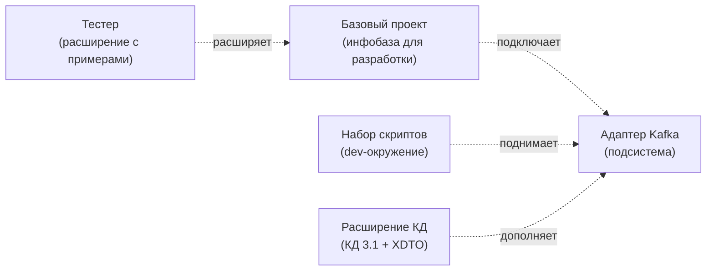

# Репозитории

Разработка ведётся в следующих репозиториях:

| Репозиторий | Назначение |
|-------------|-----------|
| [**Адаптер Kafka**](https://github.com/ShadobaAI/kafka-adapter) | Исходный код подсистемы (этот репозиторий) |
| [**Базовый проект**](https://github.com/ShadobaAI/kafka-adapter-base) | Конфигурация базы данных — базовая конфигурация для разработки |
| [**Тестер**](https://github.com/ShadobaAI/kafka-adapter-tester) | Тестовое расширение: примеры использования API и отладка интеграции |
| [**Набор скриптов**](https://github.com/ShadobaAI/kafka-tools) | Скрипты для развёртывания среды разработки |
| [**Расширение КД**](https://github.com/ShadobaAI/kafka-adapter-conv) | Расширение для КД 3.1.6+, адаптирующее типовую конвертацию данных под произвольный XDTO |

## Взаимосвязи

## Связанные проекты (внешние)

- **[Simple Kafka Connector 1C](https://github.com/NuclearAPK/Simple-Kafka_Adapter)** — внешний компонент (DLL), на котором построен адаптер.
- **[Kafka1CExtension](https://github.com/NuclearAPK/Kafka1CExtension)** — базовый проект, послуживший отправной точкой.
- **[JSONEditor](https://github.com/josdejong/jsoneditor)** — UI-редактор JSON, встроенный в адаптер.
- **[RDT1C](https://github.com/tormozit/RDT1C)** — инструменты разработчика 1С.
- **[tools_ui_1c](https://github.com/cpr1c/tools_ui_1c)** — универсальные инструменты для управляемых форм.
- **[YAxUnit](https://github.com/bia-technologies/yaxunit)** — фреймворк для юнит-тестирования.
