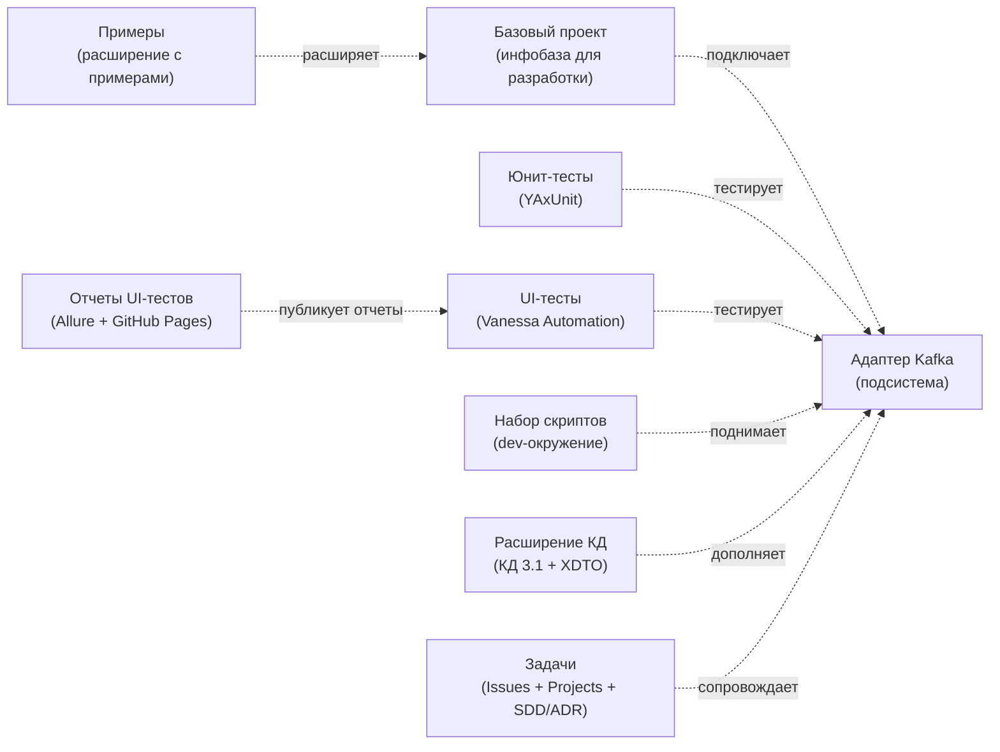

# Репозитории

Проект состоит из нескольких репозиториев — у каждого своя роль.

| Репозиторий | Назначение |
|-------------|-----------|
| [**Адаптер Kafka**](https://github.com/ShadobaAI/kafka-adapter) | Исходный код подсистемы (этот репозиторий) |
| [**Базовый проект**](https://github.com/ShadobaAI/kafka-adapter-base) | Конфигурация базы данных — базовая конфигурация для разработки |
| [**Примеры**](https://github.com/ShadobaAI/kafka-adapter-examples) | Тестовое расширение: примеры использования API и отладка интеграции |
| [**Юнит-тесты**](https://github.com/ShadobaAI/kafka-adapter-tests-unit) | Юнит-тесты адаптера Kafka: YAxUnit |
| [**UI-тесты**](https://github.com/ShadobaAI/kafka-adapter-tests-ui) | UI-тесты адаптера Kafka: Vanessa Automation |
| [**Отчеты тестов**](https://github.com/ShadobaAI/kafka-adapter-tests-reports) | Опубликованные Allure HTML-отчеты тестов |
| [**Набор скриптов**](https://github.com/ShadobaAI/kafka-tools) | Скрипты для развёртывания среды разработки |
| [**Расширение КД**](https://github.com/ShadobaAI/kafka-adapter-conv) | Расширение для КД 3.1+, адаптирующее типовую конвертацию данных под произвольный XDTO |
| [**Задачи**](https://github.com/ShadobaAI/kfk-tasks) | Issues, [доска GitHub Projects](https://github.com/users/ShadobaAI/projects/3/views/1), история изменений в SDD и ADR |

## Взаимосвязи

```mermaid
flowchart LR
    ADAPTER["Адаптер Kafka<br/>(подсистема)"]
    BASE["Базовый проект<br/>(инфобаза для разработки)"]
    examples["Примеры<br/>(расширение с примерами)"]
    TESTS_UNIT["Юнит-тесты<br/>(YAxUnit)"]
    TESTS_UI["UI-тесты<br/>(Vanessa Automation)"]
    TESTS_UI_REPORTS["Отчеты UI-тестов<br/>(Allure + GitHub Pages)"]
    TOOLS["Набор скриптов<br/>(dev-окружение)"]
    CONV["Расширение КД<br/>(КД 3.1 + XDTO)"]
    TASKS["Задачи<br/>(Issues + Projects + SDD/ADR)"]

    BASE -.подключает.-> ADAPTER
    examples -.расширяет.-> BASE
    TESTS_UNIT -.тестирует.-> ADAPTER
    TESTS_UI -.тестирует.-> ADAPTER
    TESTS_UI_REPORTS -.публикует отчеты.-> TESTS_UI
    TOOLS -.поднимает.-> ADAPTER
    CONV -.дополняет.-> ADAPTER
    TASKS -.сопровождает.-> ADAPTER
```

## Что где лежит и когда нужно

### Адаптер Kafka { #адаптер-kafka }

Главный репозиторий. Внутри: исходники подсистемы в формате EDT (`src/` — XML `.mdo` + BSL `.bsl`), документация MkDocs (`docs/`), CI-воркфлоу сборки релизов и деплоя документации (`.github/workflows/`). Нужен всем: пользователи берут отсюда [релизы](https://github.com/ShadobaAI/kafka-adapter/releases), контрибьюторы — исходники.

### Базовый проект

Минимальная конфигурация с БСП — информационная база, на которой ведётся разработка и тестирование адаптера. Адаптер подключается к ней как библиотека. Нужен контрибьютору с самого начала — см. [onboarding-маршрут](index.md#с-чего-начать-разработку-адаптера).

### Примеры

Расширение с примерами использования API: обработчики продюсеров/консьюмеров, произвольные события, прямой API. На его коде основан раздел [Примеры](../user/examples/index.md). Удобен как песочница для ручной отладки интеграции.

### Локальный workspace юнит-тестов

В `tests/unit` используются четыре отдельных EDT-проекта: собранная из `kafka-adapter-base` и `kafka-adapter` конфигурация `base`, расширение с тестовыми данными `examples`, расширение модульных тестов `unit` и отдельный checkout ядра [YAxUnit](https://github.com/bia-technologies/yaxunit) в `yaxunit`. Сборочный скрипт пересоздаёт только `base`; три расширения подключаются к ней отдельно.

### Набор скриптов (kafka-tools)

Docker Compose-манифесты и скрипты: локальный кластер Kafka, ELK для внешнего логирования, готовые настройки индексов Elasticsearch / OpenSearch. Нужен для развёртывания [окружения разработки](environment.md).

### Расширение КД

Расширение для 1С:Конвертация данных 3.1+, адаптирующее типовую конвертацию под произвольный XDTO. Нужно только тем, кто использует [КД 3.1](../user/development/conversion-data.md) как способ сериализации.

### Задачи (kfk-tasks)

Единый репозиторий сопровождения проекта. [GitHub Issues](https://github.com/ShadobaAI/kfk-tasks/issues) используются для постановки и обсуждения задач, а ход работ отображается на [доске GitHub Projects](https://github.com/users/ShadobaAI/projects/3/views/1).

Текущие правила и контракты проекта описаны в документации репозиториев-владельцев. Документация адаптера содержит [архитектуру](../overview/architecture.md), [публичный API](../user/development/api.md), [потоки данных](../overview/data-flow.md) и [правила разработки](contributing.md). SDD и ADR в [репозитории задач](https://github.com/ShadobaAI/kfk-tasks) сохраняют историю значимых изменений и решений; после реализации необходимо также актуализировать текущую документацию. Обсуждение и результаты проверок остаются в Issues, pull requests и Git.

## Тестирование { #тестирование }

За тесты отвечают три репозитория:

| Контур | Репозиторий | Инструмент | Что покрывает |
|--------|-------------|------------|---------------|
| Юнит-тесты | [kafka-adapter-tests-unit](https://github.com/ShadobaAI/kafka-adapter-tests-unit) | [YAxUnit](https://github.com/bia-technologies/yaxunit) | Логика общих модулей: регистрация, маршрутизация, сериализация |
| UI-тесты | [kafka-adapter-tests-ui](https://github.com/ShadobaAI/kafka-adapter-tests-ui) | [Vanessa Automation](https://github.com/Pr-Mex/vanessa-automation) | Открытие форм списков и объектов, запись элементов и групп справочников. Набор сценариев находится в процессе расширения |
| Отчёты | [kafka-adapter-tests-reports](https://github.com/ShadobaAI/kafka-adapter-tests-reports) | Allure + GitHub Pages | Публикация HTML-отчётов о прогонах (со скриншотами UI-тестов) |

**В CI** тесты встроены в конвейер выпуска: юнит- и UI-тесты выполняются последовательными шагами одного job `tests` в Docker-образе с полноценной 1С (виртуальный дисплей Xvfb для GUI-тестов). UI-тесты запускаются только после успешных юнит-тестов; файлы релиза публикуются **только после успешного прохождения** обоих контуров. [Coverage41C](https://github.com/1c-syntax/Coverage41C) собирает покрытие во время каждого прогона тестов. Отдельный job `sonar` выполняет статический анализ исходников и импортирует покрытие; результаты выполнения тестов представлены в Allure.

Для отбора юнит-тестов используется [YaxParams.json](https://github.com/ShadobaAI/kafka-adapter-tests-unit/blob/main/YaxParams.json) с фильтром `tags: ["CI"]`. Конвейер скачивает этот файл из ветки `main` репозитория тестов, а расширение `unit.cfe` — из пакета `ghcr.io/shadobaai/unit:latest`. Поэтому наличие сценария в локальных исходниках не подтверждает его участие в конкретном CI-прогоне. Регистрация и теги определяют отбор, а факт выполнения и результат проверяются по отчёту и логам этого запуска.

**Локально** юнит-тесты запускаются из EDT на базовом проекте с подключёнными адаптером и тестовыми расширениями — подготовка и запуск описаны в [README юнит-тестов](https://github.com/ShadobaAI/kafka-adapter-tests-unit#readme). UI-сценарии и инструкции их локального запуска дополняются; текущий запуск в CI описан в [release-quality.yml](https://github.com/ShadobaAI/kafka-adapter/blob/main/.github/workflows/release-quality.yml).

### Последние отчёты

- [Все отчёты последнего опубликованного запуска](https://shadobaai.github.io/kafka-adapter-tests-reports/latest/).
- [Allure Unit — модульные тесты](https://shadobaai.github.io/kafka-adapter-tests-reports/latest/allure-unit/).
- [Allure UI — интерфейсные тесты](https://shadobaai.github.io/kafka-adapter-tests-reports/latest/allure-ui/).
- [SonarQube — статический анализ и покрытие](https://shadobaai.github.io/kafka-adapter-tests-reports/latest/sonar/).

Если отчёт не сформирован, вместо него отображается сообщение со ссылкой на логи и артефакты CI. Это не означает успешного прохождения тестов. Подробнее — [публикация отчётов CI](environment.md#публикация-отчётов-ci).

## Связанные проекты (внешние)

- **[Simple Kafka Connector 1C](https://github.com/NuclearAPK/Simple-Kafka_Adapter)** — внешний компонент (DLL), на котором построен адаптер.
- **[Kafka1CExtension](https://github.com/NuclearAPK/Kafka1CExtension)** — базовый проект, послуживший отправной точкой.
- **[JSONEditor](https://github.com/josdejong/jsoneditor)** — UI-редактор JSON, встроенный в адаптер.
- **[RDT1C](https://github.com/tormozit/RDT1C)** — инструменты разработчика 1С.
- **[tools_ui_1c](https://github.com/cpr1c/tools_ui_1c)** — универсальные инструменты для управляемых форм.
- **[YAxUnit](https://github.com/bia-technologies/yaxunit)** — фреймворк для юнит-тестирования.
- **[onec-docker](https://github.com/firstBitMarksistskaya/onec-docker)** — репозиторий, использованный при создании CI.
