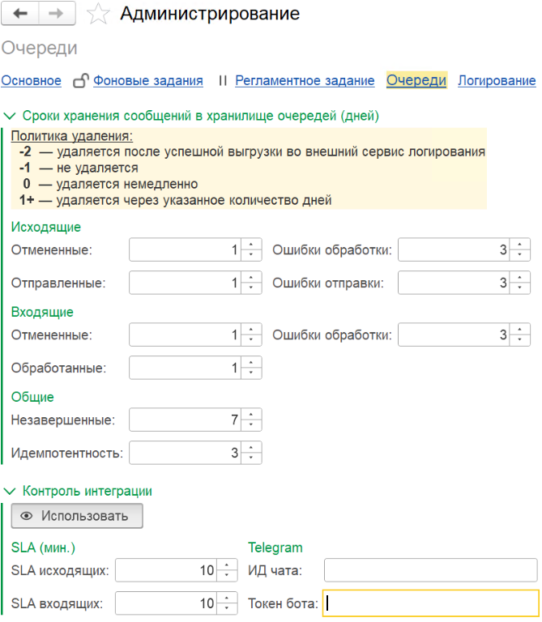

# Алерты и контроль интеграции

Откройте **Kafka / Администрирование / Очереди**.

{ loading=lazy }

## Сроки хранения сообщений

Задаются **раздельно** для каждого статуса исходящих и входящих сообщений:

| Значение | Поведение |
|----------|-----------|
| `-2` | Удалять **после выгрузки** в сервис [внешнего логирования](logging.md) |
| `-1` | **Не удалять** |
| `0` | Удалять **немедленно**. Если включено [внешнее логирование](logging.md) — ведёт себя как `-2`: удаление происходит только **после выгрузки** записи |
| `N` | Удалять через `N` дней |

!!! tip "Практика"
    Для **Отменённых** и **Обработанных** типично задают 1–7 дней; для **Ошибок** — 30 дней и больше (или `-1` — не удалять), чтобы иметь историю для разбора инцидентов.

## Контроль интеграции

Доступен **только** если срок хранения **всех** статусов, кроме «Отменённые», составляет **1 день и более**. Это требуется, чтобы у контролёра были данные за окно анализа.

| Поле / кнопка | Описание |
|---------------|----------|
| **Использовать** | Включает/выключает контроль интеграции |
| **SLA исходящих** | Допустимое время обработки исходящих сообщений (мин.) |
| **SLA входящих** | Допустимое время обработки входящих сообщений (мин.) |
| **Окно анализа** | Период, за который проверяются нарушения SLA (мин.) |
| **ИД чата** | Идентификатор чата Telegram для алертов |
| **Токен бота** | Токен Telegram-бота |

### Как настроить Telegram-бота

1. В Telegram найдите [@BotFather](https://t.me/BotFather) и создайте бота командой `/newbot`.
2. Получите **токен бота** — длинная строка вида `1234567890:AA...`.
3. Создайте **чат** или **канал** и добавьте туда бота с правом отправки сообщений.
4. Получите **идентификатор чата** — через любого бота-помощника (например, `@userinfobot`) или через `getUpdates` API.
5. Внесите оба значения в настройки контроля.
6. Проверьте — нарушение SLA должно привести к отправке уведомления.
