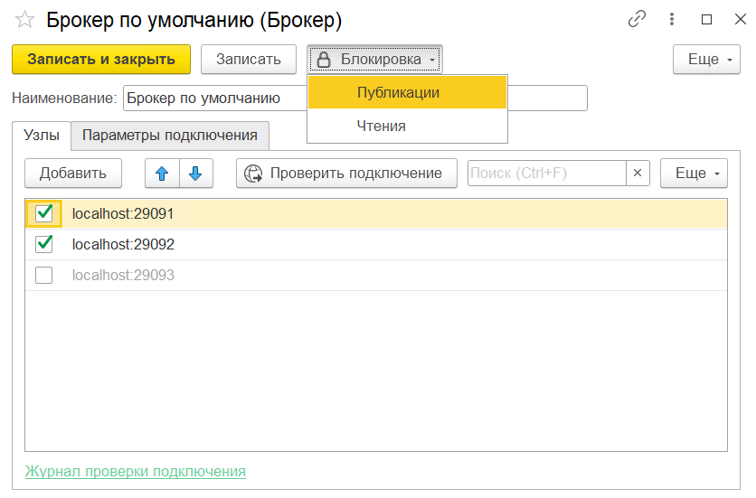

# Брокеры

**Брокер** (broker) — узел кластера Kafka, принимающий и хранящий сообщения. Один элемент справочника **Брокеры** соответствует одному кластеру Kafka.

Откройте **Kafka / Брокеры** и создайте новый элемент.

{ loading=lazy }

## Команды формы

| Команда | Описание |
|---------|----------|
| **Блокировка / Публикация** | Временно останавливает отправку сообщений через этот брокер |
| **Блокировка / Чтения** | Временно останавливает получение сообщений через этот брокер |

## Основные поля

| Поле | Описание |
|------|----------|
| **Наименование** | Произвольное название для идентификации кластера |

## Узлы

Список узлов кластера (bootstrap-серверов):

| Поле | Описание |
|------|----------|
| *(признак активности)* | Включает/выключает конкретный узел |
| **Адрес** | Адрес узла в формате `host:port` |

!!! tip "Несколько узлов"
    Укажите **несколько** узлов для отказоустойчивости — Kafka-клиент автоматически получит актуальную топологию кластера через любой доступный из перечисленных.

## Параметры подключения

Дополнительные параметры [librdkafka](https://github.com/confluentinc/librdkafka) (SASL, SSL, тайм-ауты и др.):

| Поле | Описание |
|------|----------|
| **Ключ** | Название параметра (например, `security.protocol`) |
| **Значение** | Значение параметра |
| **Режим пароля** | Скрывает значение в форме — используется для паролей и токенов |

!!! info "Справочник параметров"
    Полный список: [CONFIGURATION.md в репозитории librdkafka](https://github.com/confluentinc/librdkafka/blob/master/CONFIGURATION.md).

## Защищённое подключение

Примеры параметров для SASL/PLAIN, SASL/SCRAM и SSL/TLS — см. [Защищённое подключение](../examples/secure-connection.md).

!!! tip "Включайте «Режим пароля»"
    Для всех полей с секретными значениями (пароли, токены, закрытые ключи) устанавливайте галку **Режим пароля** — значение скрывается в форме и не попадает в логи.

---

После создания брокера перейдите к настройке [продюсеров](producers.md) и [консьюмеров](consumers.md).
