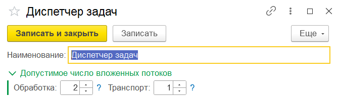
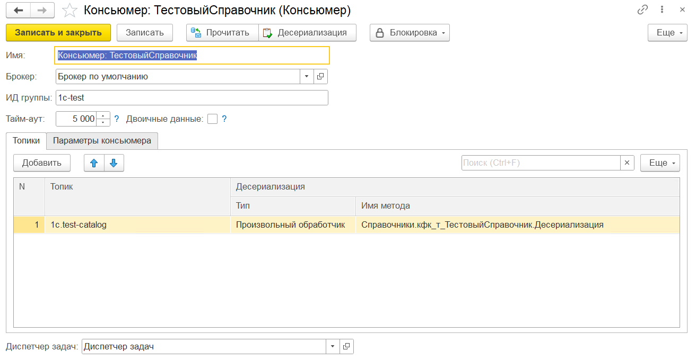
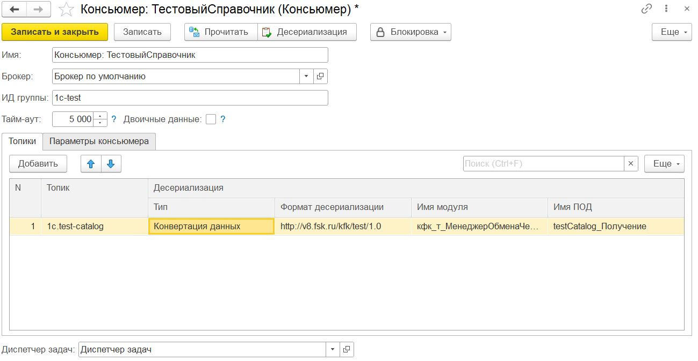

# Консьюмеры

**Консьюмер** (consumer) — получатель сообщений из Kafka.

Справочник **Консьюмеры** имеет **двухуровневую** структуру:

- **Диспетчер задач** — группа консьюмеров с общими параметрами параллелизма;
- **Консьюмер** — настройки чтения для конкретного топика.

---

## Диспетчер задач

Создаётся **отдельной кнопкой** в списке консьюмеров.

{ loading=lazy }

### Поля диспетчера

| Поле | Описание |
|------|----------|
| **Наименование** | Произвольное название диспетчера |
| **Подпотоки обработки** | Количество параллельных потоков **десериализации** |
| **Подпотоки транспорта** | Количество параллельных потоков **чтения** из Kafka |

---

## Консьюмер

=== "Произвольный обработчик"

    { loading=lazy }

=== "Конвертация данных"

    { loading=lazy }

### Команды формы

| Команда | Описание |
|---------|----------|
| **Блокировка / Чтения** | Останавливает получение новых сообщений из Kafka |
| **Блокировка / Десериализации** | Останавливает обработку полученных сообщений |

### Основные поля

| Поле | Описание |
|------|----------|
| **Наименование** | Произвольное название консьюмера |
| **Брокер** | Брокер Kafka, из которого читаются сообщения |
| **Идентификатор** | Идентификатор группы консьюмеров (`consumer group id`) — все консьюмеры с одним идентификатором получают **разные** сообщения из топика |
| **Тайм-аут ожидания** | Время ожидания сообщений от брокера в миллисекундах |
| **Двоичные данные** | Получать тело сообщения как двоичные данные (не преобразовывать в строку) |

!!! warning "Consumer group id"
    Если два консьюмера настроены с **одним** `consumer group id` и подписаны на один топик — Kafka будет **распределять** сообщения между ними (каждое сообщение уходит только одному). Для **параллельной** обработки одного потока сообщений несколькими консьюмерами используйте **разные** идентификаторы.

### Топики

Из каких топиков читать и как обрабатывать:

| Поле | Описание |
|------|----------|
| **Топик** | Имя топика Kafka, из которого читаются сообщения |
| **Тип десериализации** | Способ обработки: **Конвертация данных** или **Произвольный обработчик** |
| **Имя метода десериализации** | Для **«Произвольный обработчик»** — имя экспортного метода |
| **Имя модуля десериализации** | Для **«Произвольный обработчик»** — имя общего модуля |
| **Имя ПОД десериализации** | Для **«Конвертация данных»** — имя правил обработки данных из модуля обмена КД 3.1 |
| **Формат десериализации** | URL пространства имён XDTO-пакета |

!!! info "Автодополнение топиков"
    При открытии формы консьюмера список доступных топиков автоматически запрашивается из брокера Kafka через Admin API и становится доступен для выбора и автодополнения в поле **Топик**. При смене брокера список обновляется. Системные внутренние топики Kafka в список не включаются.

### Параметры консьюмера

Дополнительные параметры [librdkafka](https://github.com/confluentinc/librdkafka):

| Поле | Описание |
|------|----------|
| **Ключ** | Название параметра |
| **Значение** | Значение параметра |

---

## Примеры

- [Upsert справочника из входящего сообщения](../examples/incoming-catalog.md)
- [Запись в независимый регистр сведений](../examples/incoming-register.md)
- [Отмена обработки с сохранением причины](../examples/incoming-cancel.md)

## Связанные разделы

- [Обработчик консьюмера — контракт](../development/consumer-handler.md)
- [Конвертация данных 3.1](../development/conversion-data.md)
