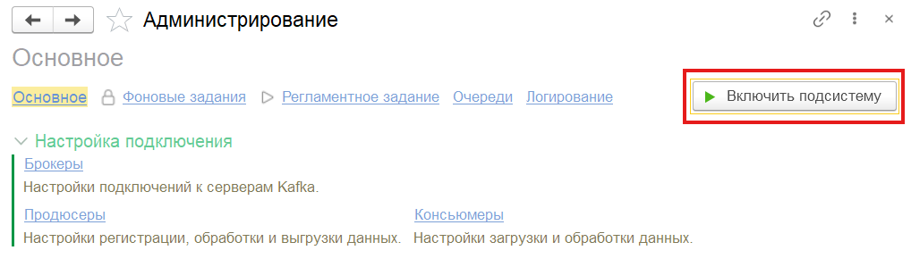
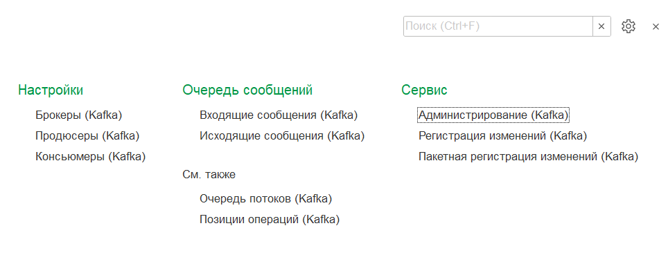

# Настройка подсистемы

Справочное руководство по настройке адаптера в режиме 1С:Предприятие. Выполняется после [установки и подключения](../installation/index.md).

## Включение подсистемы

Откройте **Kafka / Администрирование** и нажмите **Включить подсистему**.

{ loading=lazy }

Для временной приостановки обмена **без** отключения подсистемы откройте **Kafka / Администрирование / Фоновые задания** и нажмите **Заблокировать**. Для возобновления — **Разблокировать**.

## Разделы меню Kafka

После включения подсистемы в меню **Kafka** становятся доступны следующие разделы:

{ loading=lazy }

| Раздел | Описание |
|--------|----------|
| **Настройки / Брокеры** | Управление подключениями к кластерам Kafka |
| **Настройки / Продюсеры** | Настройка отправки сообщений: объекты, топики, обработчики |
| **Настройки / Консьюмеры** | Настройка получения сообщений: топики, обработчики |
| **Очередь сообщений / Исходящие сообщения** | Просмотр очереди исходящих сообщений и их статусов |
| **Очередь сообщений / Входящие сообщения** | Просмотр очереди входящих сообщений и их статусов |
| **Сервис / Администрирование** | Управление подсистемой: включение, фоновые задания, мониторинг, логирование |
| **Сервис / Регистрация изменений** | Ручная регистрация объектов в очереди исходящих |
| **Сервис / Пакетная регистрация изменений** | Массовая регистрация объектов в очереди исходящих |

## Следующие шаги

-   :material-server-network:{ .lg } **[Брокеры](brokers.md)**

    ---

    Параметры подключения к кластерам Kafka.

-   :material-arrow-up-bold-box:{ .lg } **[Продюсеры](producers.md)**

    ---

    Настройка отправки: объекты 1С, топики, сериализация.

-   :material-arrow-down-bold-box:{ .lg } **[Консьюмеры](consumers.md)**

    ---

    Настройка получения: топики, десериализация, группы.

-   :material-timer-cog:{ .lg } **[Фоновые и регламентные задания](jobs.md)**

    ---

    Расписание запуска и потоковый режим.

-   :material-bell-ring:{ .lg } **[Алерты и контроль](alerts.md)**

    ---

    Сроки хранения, SLA и уведомления в Telegram.

-   :material-file-document-outline:{ .lg } **[Логирование](logging.md)**

    ---

    Файловые логи компоненты и выгрузка в ELK / Loki.

