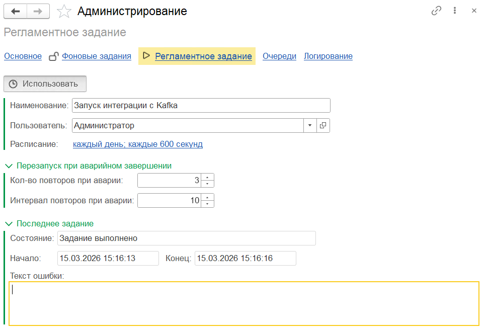

# Фоновые и регламентные задания

## Фоновые задания

Откройте **Kafka / Администрирование / Фоновые задания**.

{ loading=lazy }

На этой вкладке отображается состояние всех потоков подсистемы (сериализация, десериализация, выгрузка, загрузка).

**Кнопка «Заблокировать / Разблокировать»** — временная приостановка обмена без отключения подсистемы:

- **Заблокировать** — все потоки останавливаются после завершения текущей порции.
- **Разблокировать** — потоки возобновляют работу.

## Регламентное задание

Откройте **Kafka / Администрирование / Регламентное задание** и активируйте задание `Использовать`. Там же задаются:

- **Расписание запуска** — интервал запуска диспетчера;
- **Пользователь обмена** — от имени какого пользователя выполняются фоновые задания.

{ loading=lazy }

## Потоковый режим

При необходимости включите **«Использовать потоковый режим»**.

В этом режиме фоновые задания (сериализация, десериализация, выгрузка, загрузка) **не завершаются** после обработки очереди, а остаются активными и ждут появления новых данных.

При отсутствии нагрузки потоки автоматически завершаются через **5 минут**.

!!! tip "Когда включать"
    Потоковый режим оправдан при высокой нагрузке, когда время запуска фонового задания соизмеримо с временем обработки порции. Для редкого обмена (несколько сообщений в час) — оставьте обычный режим.

## Требования к пользователю обмена

Пользователь, указанный в регламентном задании, должен иметь:

- права на запуск **фоновых заданий**;
- доступ к регистрам и справочникам подсистемы;
- права на регистрацию событий в журнале регистрации 1С;
- (если настроен внешний логгер) доступ к интернет-ресурсам сервера 1С для отправки логов.

## Требования к серверу 1С

На сервере 1С должны быть **разрешены фоновые задания** (параметр кластера). Если задания не запускаются — см. [Типовые проблемы](../operations/troubleshooting.md#фоновые-задания-не-запускаются).
