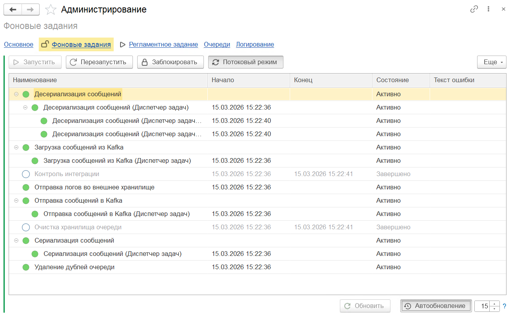
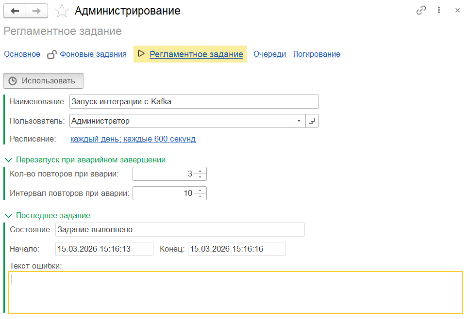

# Фоновые и регламентные задания

## Фоновые задания

Откройте **Kafka / Администрирование / Фоновые задания**.

{ loading=lazy }

На этой вкладке отображается состояние всех потоков подсистемы (сериализация, десериализация, выгрузка, загрузка).

**Кнопка «Заблокировать / Разблокировать»** — временная приостановка обмена без отключения подсистемы:

- **Заблокировать** — все потоки останавливаются после завершения текущей порции.
- **Разблокировать** — потоки возобновляют работу.

## Применение изменений настроек { #settings-restart }

Настройки кэшируются при старте фонового потока. После сохранения изменений уже работающие потоки продолжают использовать прежние значения; чтобы применить новые, перезапустите их. Это касается обоих направлений обмена и особенно важно в [потоковом режиме](#потоковый-режим), когда задания остаются активными между порциями.

1. Сохраните изменения настроек.
2. Откройте **Kafka / Администрирование / Фоновые задания**.
3. Нажмите **Перезапустить**. Новые потоки загрузят актуальные настройки.

## Регламентное задание

Откройте **Kafka / Администрирование / Регламентное задание** и активируйте задание `Использовать`. Там же задаются:

- **Расписание запуска** — интервал запуска диспетчера;
- **Пользователь обмена** — от имени какого пользователя выполняются фоновые задания.

{ loading=lazy }

При [подключении к подсистемам БСП](../installation/adaptation.md#подключение-к-подсистемам-бсп) задание зависит от включения подсистемы Kafka (`кфкИспользоватьИнтеграцию`) и учитывается БСП как работающее с внешними ресурсами.

Перед запуском потоков выполняются штатные проверки БСП. Если для задания действует блокировка работы с внешними ресурсами, например после копирования или переноса информационной базы, БСП отключает задание и прерывает его выполнение. Причина записывается в журнал регистрации 1С. Разрешение работы с внешними ресурсами и индивидуальные разрешения запуска заданий управляются штатными средствами БСП.

Для запуска потоков также должна быть снята блокировка обмена на вкладке **«Фоновые задания»**.

## Потоковый режим

При необходимости включите **«Использовать потоковый режим»**.

В этом режиме фоновые задания (сериализация, десериализация, выгрузка, загрузка) **не завершаются** после обработки очереди, а остаются активными и ждут появления новых данных.

Для потоков обработки локальных очередей действует тайм-аут простоя **5 минут**. У потоков загрузки из Kafka другое условие: тайм-аут действует, когда потоку не назначены консьюмеры. Если консьюмеры назначены, поток продолжает опрашивать Kafka даже при отсутствии новых сообщений.

!!! tip "Когда включать"
    Потоковый режим оправдан при высокой нагрузке, когда время запуска фонового задания соизмеримо с временем обработки порции. Для редкого обмена (несколько сообщений в час) — оставьте обычный режим.

## Требования к пользователю обмена

Пользователь, указанный в регламентном задании, должен иметь:

- права на запуск **фоновых заданий**;
- доступ к регистрам и справочникам подсистемы;
- права на регистрацию событий в журнале регистрации 1С;
- (если настроен внешний логгер) доступ к интернет-ресурсам сервера 1С для отправки логов.

## Требования к серверу 1С

На сервере 1С должны быть **разрешены фоновые задания** (параметр кластера). Если задания не запускаются — см. [Типовые проблемы](../operations/troubleshooting.md#фоновые-задания-не-запускаются).
