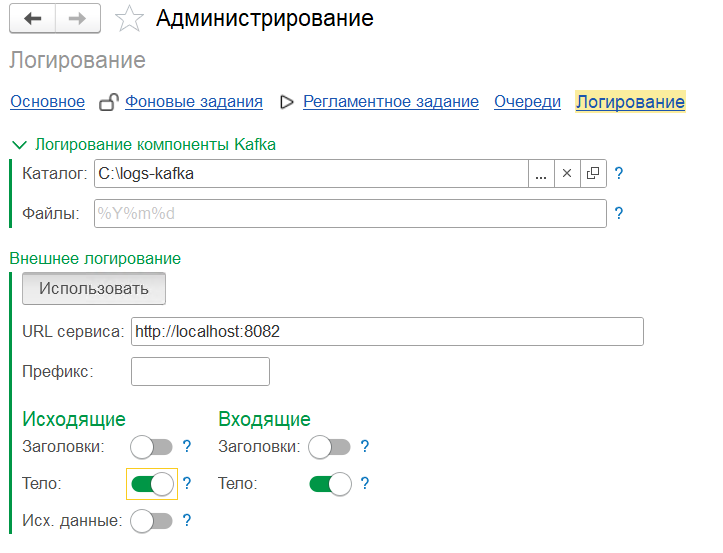

# Логирование

Откройте **Kafka / Администрирование / Логирование**.

{ loading=lazy }

## Логирование компоненты Kafka

Низкоуровневые логи внешней компоненты (librdkafka) в файлы на сервере 1С.

| Поле | Описание |
|------|----------|
| **Каталог** | Путь на сервере для лог-файлов внешней компоненты |
| **Файлы** | Формат даты в имени лог-файла (strftime, по умолчанию `%Y%m%d` — новый файл каждый день) |

### Именование лог-файлов

Имена файлов формируются по шаблону:

```
{type}_{client.id}_{pid}_{dateformat}.log
```

| Плейсхолдер | Значение |
|-------------|----------|
| `type` | Тип логгера: `producer`, `consumer`, `statistics`, `dump` |
| `client.id` | Идентификатор клиента — параметр `client.id` продюсера/консьюмера |
| `pid` | Идентификатор процесса на сервере 1С |
| `dateformat` | Дата в формате из поля **Файлы** (по умолчанию `%Y%m%d`) |

Так логи разных продюсеров, консьюмеров и рабочих процессов разводятся по отдельным файлам, а по дате файлы ротируются.

!!! info "Когда нужны эти логи"
    Подключение, отправка, ошибки брокера, SASL/SSL — всё это фиксируется здесь на низком уровне. Полезно для отладки сетевых проблем и проблем аутентификации.

## Внешнее логирование

Выгрузка **журнала обмена** в совместимый HTTP/HTTPS-приёмник. Адаптер отправляет `POST` с gzip-сжатым JSON-массивом событий, заголовками `Content-Type: application/json` и `Content-Encoding: gzip`; успешным считается ответ **HTTP 200**.

Для передачи в Logstash, Elasticsearch, OpenSearch или Loki приёмник должен принять этот формат и при необходимости преобразовать его в формат выбранного хранилища. Адрес API хранилища, принимающий произвольный JSON, сам по себе не гарантирует совместимость.

| Поле / кнопка | Описание |
|---------------|----------|
| **Использовать** | Включает/выключает выгрузку |
| **URL сервиса** | Адрес эндпоинта (например, `https://hostname:8080/my-logs`) |
| **Префикс** | Префикс, добавляемый к имени логгера (см. ниже) |
| **Исходящие — Заголовки / Тело / Исх. данные** | Что выгружать по исходящим сообщениям |
| **Входящие — Заголовки / Тело** | Что выгружать по входящим сообщениям |

### Что даёт внешнее логирование

- **История обмена в привычных инструментах** (Kibana, Grafana Loki Explore).
- **Поиск и аналитика** по огромным объёмам данных без нагрузки на 1С.
- **Срок хранения** в 1С можно уменьшить (`-2` — удалять после выгрузки), когда приёмник подтверждает сохранение событий ответом HTTP 200. Дальнейшее хранение определяется внешней системой.
- **Обновление текущего состояния сообщений** во внешнем хранилище возможно, если приёмник настроен на upsert по передаваемому `id` (см. ниже).

### Именование логгеров

Записи выгружаются с именем логгера по шаблону:

```
[префикс-]kfk-producer
[префикс-]kfk-consumer
```

где `префикс` — значение поля **Префикс** (может быть пустым). Идентификатор конкретного продюсера/консьюмера в имя логгера **не входит** — иначе каждая настройка порождала бы отдельный индекс в Elasticsearch / OpenSearch, что приводит к разрастанию числа индексов и ошибкам на стороне хранилища.

### Как работает выгрузка

- Выгрузка в HTTP-эндпоинт идёт после минутной задержки от метки изменения записи в РС «Исходящие / Входящие сообщения». Задержка группирует промежуточные статусы и уменьшает количество отправляемых записей.
- Исходящие и входящие логи выбираются ограниченными порциями: `МеткаИзменения > Позиция` и ниже временной границы, с сортировкой по полной комбинированной метке изменения. После HTTP-ответа с кодом `200` сохраняется метка последней строки порции; при ошибке сохранённая позиция не меняется, порция будет прочитана повторно. При отсутствии событий позиция может продвинуться до временной границы «текущее время минус 15 минут».
- Порционная выгрузка требует уникальных меток изменения внутри каждого направления: строки с одинаковой меткой на границе порции могут быть пропущены. Перед запуском на исторических данных проверьте результат миграции по [инструкции обновления](../installation/updating.md#переход-на-комбинированные-метки).
- Каждая запись журнала содержит **идентификатор события**: полную первичную метку и ключ записи регистра.
- Примеры настройки внешнего логирования для **Elasticsearch** и **OpenSearch** — в репозитории [ShadobaAI/kafka-tools](https://github.com/ShadobaAI/kafka-tools). Для модели «одно сообщение — один документ текущего состояния» приёмник должен выполнять **upsert по `id`**. Адаптер передаёт стабильный `id`, но сам не задаёт способ записи во внешнее хранилище.

!!! tip "Следствие для дашбордов"
    При настроенном upsert по `id` и подтверждённой загрузке актуальных событий документ отражает **текущее** состояние сообщения. Тогда отчёты можно строить без подсчёта повторных переходов статусов. При добавлении каждого события отдельной записью потребуется учитывать повторы и историю состояний.

### Метки в JSON

| Поле | Тип JSON | Значение |
| --- | --- | --- |
| `@timestamp` | строка | Дата и время UTC первичной метки в формате ISO с миллисекундами и суффиксом `Z` |
| `combined_mark` | строка | Полная метка изменения в десятичной записи |
| `change_mark_timestamp` | строка | Дата и время UTC метки изменения в том же формате |
| `change_mark_session_number` | число | Номер сеанса метки изменения |
| `change_mark_sequence_number` | число | Порядковый номер метки изменения |
| `load_date_ms` | число | Только для входящих: миллисекунды первичной метки от 01.01.0001 UTC |

Полная метка передаётся строкой, поскольку число длиной до 30 знаков может потерять точность у потребителя JSON. Для исходящего сообщения также передаются числовые `registration_mark_session_number` и `registration_mark_sequence_number`, для входящего — `load_mark_session_number` и `load_mark_sequence_number`.

У исторических меток компонент номера сеанса равен `0`. Обработчик миграции использует один порядковый номер для обоих полей сообщения; счётчик циклический `1..99999999` и сквозной для каждого регистра в пределах одного вызова. Временная составляющая определяется сохранёнными миллисекундами.

После преобразования старых меток меняется `id` уже опубликованных сообщений. При повторной выгрузке граничной миллисекунды во внешнем хранилище возможны дубли со старым и новым `id`; учтите это при обновлении индекса или дашбордов.

### Требования

- На сервере 1С должен быть доступен **интернет-ресурс** по указанному URL.
- Пользователь обмена должен иметь право использовать **HTTP-соединения**.

!!! tip "Срок хранения `-2`"
    Если настроен внешний логгер — ставьте **-2** для статусов, по которым не нужна долгая локальная история (например, «Обработано» и «Выгружено»). Это сильно разгрузит РС «Исходящие / Входящие сообщения».
