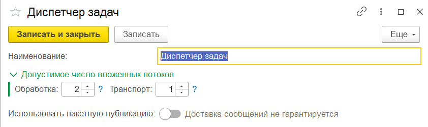
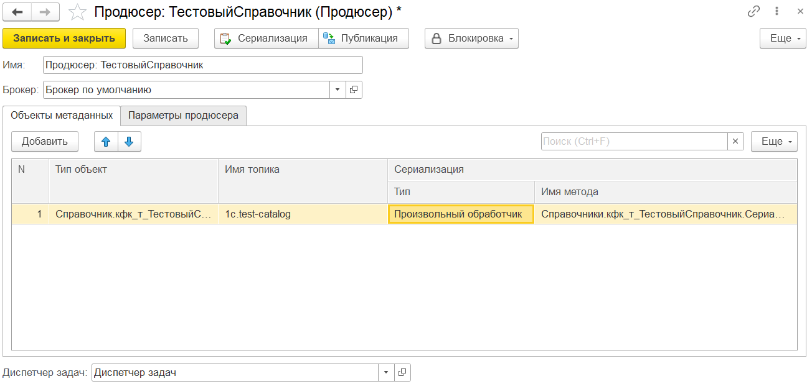
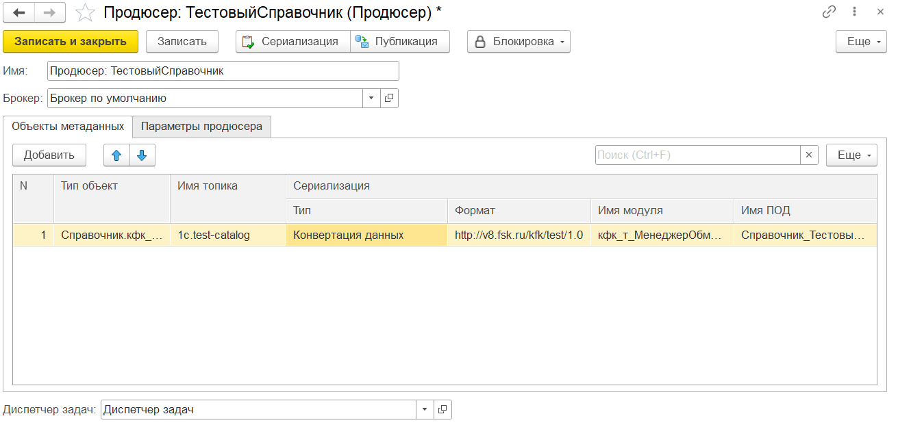

# Продюсеры

**Продюсер** (producer) — отправитель сообщений в Kafka. Один элемент может обслуживать несколько топиков и типов объектов.

Справочник **Продюсеры** имеет **двухуровневую** структуру:

- **Диспетчер задач** — группа продюсеров с общими параметрами параллелизма;
- **Продюсер** — настройки отправки для конкретного типа объектов и топика.

---

## Диспетчер задач

Группа продюсеров, отвечающая за распределение нагрузки между подпотоками.

{ loading=lazy }

### Поля диспетчера

| Поле | Описание |
|------|----------|
| **Наименование** | Произвольное название диспетчера |
| **Подпотоки обработки** | Количество параллельных потоков **сериализации** |
| **Подпотоки транспорта** | Количество параллельных потоков **отправки** в Kafka |
| **Использовать пакетную публикацию** | Отправка нескольких сообщений одним пакетом |

!!! tip "Рекомендуемое соотношение"
    **Подпотоков обработки = Подпотоков транспорта × 2** — обычно сериализация идёт быстрее, чем отправка по сети.

---

## Продюсер

Элемент справочника с конкретными настройками.

=== "Произвольный обработчик"

    { loading=lazy }

=== "Конвертация данных"

    { loading=lazy }

### Команды формы

| Команда | Описание |
|---------|----------|
| **Блокировка / Регистрации** | Останавливает постановку новых объектов в очередь |
| **Блокировка / Сериализации** | Останавливает сериализацию объектов из очереди |
| **Блокировка / Публикации** | Останавливает отправку сериализованных сообщений в Kafka |

### Основные поля

| Поле | Описание |
|------|----------|
| **Наименование** | Произвольное название продюсера |
| **Брокер** | Брокер Kafka, через который отправляются сообщения |

### Объекты метаданных { #объекты-метаданных }

Какие объекты отправляются и как:

| Поле | Описание |
|------|----------|
| **Тип объект** | **Ключ регистрации** — при поступлении сообщения в очередь адаптер ищет продюсер, у которого значение в этом поле **точно совпадает** с ключом. См. [Тип объект — ключ регистрации](#тип-объект-ключ-регистрации) ниже. Для регистров, подчинённых регистратору, указывается имя регистра — при записи в очередь будет помещён регистратор. |
| **Имя топика** | Топик Kafka, в который публикуются сообщения этого типа |
| **Тип сериализации** | Способ преобразования данных: **Конвертация данных** или **Произвольный обработчик** |
| **Имя метода сериализации** | Для **«Произвольный обработчик»** — имя экспортного метода |
| **Имя модуля сериализации** | Для **«Произвольный обработчик»** — имя общего модуля |
| **Имя ПОД сериализации** | Для **«Конвертация данных»** — имя правил обработки данных из модуля обмена КД 3.1 |
| **Формат сериализации** | URL пространства имён XDTO-пакета |

!!! info "Автодополнение топиков"
    При открытии формы продюсера список доступных топиков автоматически запрашивается из брокера Kafka через Admin API и становится доступен для выбора и автодополнения в поле **Имя топика**. При смене брокера список обновляется. Системные внутренние топики Kafka в список не включаются.

#### Тип объект — ключ регистрации { #тип-объект-ключ-регистрации }

`Тип объект` — это **строковый ключ**. При постановке сообщения в очередь адаптер ищет продюсер, у которого значение этого поля **буква-в-букву совпадает** с ключом из вызова (никаких подстрок, масок или иерархий — только полное совпадение). От значения ключа зависит, как именно срабатывает регистрация:

| Значение «Тип объект» | Автоматическая регистрация при записи | Регистрация через API |
|-----------------------|:---:|:---:|
| **Полное имя метаданных** (`Справочник.Номенклатура`, `Документ.ЗаказПокупателя`, `РегистрНакопления.ТоварыНаСкладах` и т.п.) | :material-check: — подписка адаптера отрабатывает автоматически при каждой записи объекта этого типа | :material-check: — можно вызывать `ПоместитьВОчередьИсходящих(Ссылка)` явно |
| **Произвольный ключ** (`system.events`, `crm.order-created`, `my-key`) | :material-close: — подписки на такой ключ не сработают | :material-check: — обязательно передавать ключ вторым параметром: `ПоместитьВОчередьИсходящих(Сообщение, "system.events")` |

!!! tip "Только через API — намеренно"
    Если хотите, чтобы сообщения попадали в топик **исключительно** через API (без срабатывания подписок на запись) — укажите в «Тип объект» значение, **не совпадающее** ни с одним именем метаданных (например, `crm.order-placed`). Тогда записи объектов 1С в очередь не попадут, а прикладной код будет регистрировать события сам — `ПоместитьВОчередьИсходящих(Сообщение, "crm.order-placed")`.

    Это типичный паттерн для [произвольных событий](../examples/custom-events.md).

### Параметры продюсера

Дополнительные параметры [librdkafka](https://github.com/confluentinc/librdkafka):

| Поле | Описание |
|------|----------|
| **Ключ** | Название параметра |
| **Значение** | Значение параметра |

---

## Примеры

- [Сериализация справочника](../examples/outgoing-catalog.md)
- [Сериализация документа с табличной частью](../examples/outgoing-document.md)
- [Сериализация независимого регистра сведений](../examples/outgoing-register.md)
- [Сериализация регистра по регистратору](../examples/outgoing-recorder.md)

## Связанные разделы

- [Обработчик продюсера — контракт](../development/producer-handler.md)
- [Конвертация данных 3.1](../development/conversion-data.md)
