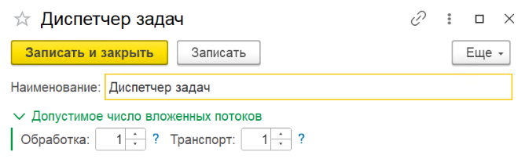
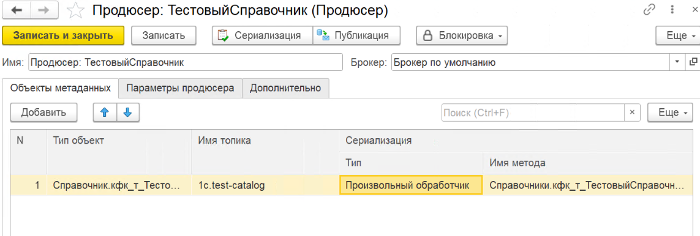
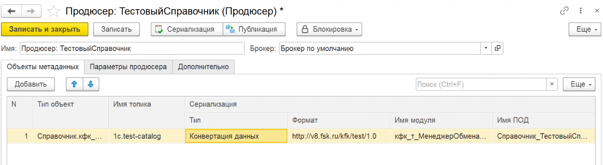
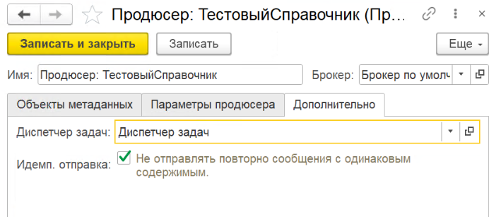

# Продюсеры

**Продюсер** (producer) — отправитель сообщений в Kafka. Один элемент может обслуживать несколько топиков и типов объектов.

Справочник **Продюсеры** имеет **двухуровневую** структуру:

- **Диспетчер задач** — группа продюсеров с общими параметрами параллелизма;
- **Продюсер** — настройки отправки для конкретного типа объектов и топика.

---

## Диспетчер задач

Группа продюсеров, отвечающая за распределение нагрузки между подпотоками.

{ loading=lazy }

### Поля диспетчера

| Поле | Описание |
|------|----------|
| **Наименование** | Произвольное название диспетчера |
| **Подпотоки обработки** | Количество параллельных потоков **сериализации** |
| **Подпотоки транспорта** | Количество параллельных потоков **отправки** в Kafka |
| **Использовать пакетную публикацию** | Отправка нескольких сообщений одним пакетом |

!!! tip "Рекомендуемое соотношение"
    **Подпотоков обработки = Подпотоков транспорта × 2** — обычно сериализация идёт быстрее, чем отправка по сети.

---

## Продюсер

Элемент справочника с конкретными настройками.

=== "Произвольный обработчик"

    { loading=lazy }

=== "Конвертация данных"

    { loading=lazy }

=== "Дополнительно"

    { loading=lazy }

### Команды формы

| Команда | Описание |
|---------|----------|
| **Блокировка / Регистрации** | Останавливает постановку новых объектов в очередь |
| **Блокировка / Сериализации** | Останавливает сериализацию объектов из очереди |
| **Блокировка / Публикации** | Останавливает отправку сериализованных сообщений в Kafka |

### Основные поля

| Поле | Описание |
|------|----------|
| **Наименование** | Произвольное название продюсера |
| **Брокер** | Брокер Kafka, через который отправляются сообщения |
| **Идемпотентная отправка** | Не отправлять повторно сообщения с одинаковым содержимым — см. [ниже](#идемпотентная-отправка) |

### Идемпотентная отправка { #идемпотентная-отправка }

При включённом флаге адаптер перед выгрузкой сравнивает **SHA-256-хэш тела сообщения** с хэшем последней успешной выгрузки по тому же ключу записи очереди (регистр «Хэш-суммы сообщений»). Если содержимое не изменилось — сообщение в Kafka **не отправляется**: запись получает статус **«Выгрузка отменена»** с текстом «Сообщение уже выгружено». Если содержимое изменилось — сообщение выгружается, а сохранённый хэш обновляется.

- Настройка включается **независимо для каждого продюсера**.
- При ошибке отправки сохранённый хэш не обновляется: после повторного назначения на отправку неизменённое тело можно выгрузить снова. При частичном успехе пакета обновляются хэши только успешно отправленных сообщений.
- Сравнение выполняется для сообщений с одинаковым **`КлючЗаписи`**, включая разные регистрации локальной очереди. История хранит хэш последней успешной выгрузки по этому ключу.
- Срок хранения истории хэшей (по умолчанию **3 дня**) настраивается в поле **Идемпотентность** на вкладке **Kafka / Администрирование / Очереди**. После удаления хэша по сроку хранения то же содержимое снова уйдёт в Kafka.

Подробнее о сценариях и способах форсировать повторную отправку — [Идемпотентность](../examples/idempotency.md).

Для защиты от дублей при сетевых повторах Kafka-клиента отдельно настраивается [`enable.idempotence`](#enable-idempotence).

### Объекты метаданных { #объекты-метаданных }

Какие объекты отправляются и как:

| Поле | Описание |
|------|----------|
| **Тип объект** | **Ключ регистрации** — при поступлении сообщения в очередь адаптер ищет продюсер, у которого значение в этом поле совпадает с ключом **без учёта регистра**. См. [Тип объект — ключ регистрации](#тип-объект-ключ-регистрации) ниже. Для регистров, подчинённых регистратору, указывается имя регистра — при записи в очередь будет помещён регистратор. |
| **Имя топика** | Топик Kafka, в который публикуются сообщения этого типа |
| **Тип сериализации** | Способ преобразования данных: **Конвертация данных** или **Произвольный обработчик** |
| **Имя метода сериализации** | Для **«Произвольный обработчик»** — полное имя экспортной функции, например `ОбменKafkaСервер.Сериализация` |
| **Имя модуля сериализации** | Для **«Конвертация данных»** — обязательное имя общего модуля менеджера обмена КД 3.1 |
| **Имя ПОД сериализации** | Для **«Конвертация данных»** — имя правил обработки данных из модуля обмена КД 3.1 |
| **Формат сериализации** | URL пространства имён XDTO-пакета |

!!! info "Автодополнение топиков"
    При открытии формы продюсера список доступных топиков автоматически запрашивается из брокера Kafka через Admin API и становится доступен для выбора и автодополнения в поле **Имя топика**. При смене брокера список обновляется. Системные внутренние топики Kafka в список не включаются.

#### Тип объект — ключ регистрации { #тип-объект-ключ-регистрации }

`Тип объект` — это **строковый ключ**. При постановке сообщения в очередь адаптер сравнивает значение этого поля с ключом из вызова **без учёта регистра**: обе строки приводятся к нижнему регистру. Например, `CRM.Event` и `crm.event` соответствуют одному ключу. Подстроки, маски и иерархии не применяются — требуется полное совпадение после приведения регистра. От значения ключа зависит, как именно срабатывает регистрация:

| Значение «Тип объект» | Автоматическая регистрация при записи | Регистрация через API |
|-----------------------|:---:|:---:|
| **Полное имя метаданных** (`Справочник.Номенклатура`, `Документ.ЗаказПокупателя`, `РегистрНакопления.ТоварыНаСкладах` и т.п.) | :material-check: — подписка адаптера отрабатывает автоматически при каждой записи объекта этого типа | :material-check: — можно вызывать `ПоместитьВОчередьИсходящих(Ссылка)` явно |
| **Произвольный ключ** (`system.events`, `crm.order-created`, `my-key`) | :material-close: — подписки на такой ключ не сработают | :material-check: — обязательно передавать ключ вторым параметром: `ПоместитьВОчередьИсходящих(Сообщение, "system.events")` |

!!! tip "Только через API — намеренно"
    Если хотите, чтобы сообщения попадали в топик **исключительно** через API (без срабатывания подписок на запись) — укажите в «Тип объект» значение, **не совпадающее** ни с одним именем метаданных (например, `crm.order-placed`). Тогда записи объектов 1С в очередь не попадут, а прикладной код будет регистрировать события сам — `ПоместитьВОчередьИсходящих(Сообщение, "crm.order-placed")`.

    Это типичный паттерн для [произвольных событий](../examples/custom-events.md).

### Параметры продюсера

Дополнительные параметры [librdkafka](https://github.com/confluentinc/librdkafka):

| Поле | Описание |
|------|----------|
| **Ключ** | Название параметра |
| **Значение** | Значение параметра |

#### Идемпотентность Kafka-клиента — `enable.idempotence` { #enable-idempotence }

`enable.idempotence=true` включает идемпотентный режим продюсера librdkafka: при внутренних повторах отправки клиент предотвращает дубли в Kafka и сохраняет порядок сообщений в пределах одной партиции. Например, если брокер записал сообщение, но подтверждение потерялось, повтор клиента не создаст вторую запись. В librdkafka значение по умолчанию — `false`.

В форме продюсера в таблице **Параметры продюсера** добавьте строку:

| Ключ | Значение |
|------|----------|
| `enable.idempotence` | `true` |

Если связанные параметры не заданы явно, librdkafka автоматически подбирает совместимые значения. При ручной настройке соблюдайте условия:

| Параметр | Условие при `enable.idempotence=true` |
|----------|-------------------------------------|
| `acks` (`request.required.acks`) | `all` (или `-1`) — подтверждение всех синхронных реплик |
| `retries` (`message.send.max.retries`) | Больше `0`; автоматически устанавливается `2147483647` (`INT32_MAX`) |
| `max.in.flight.requests.per.connection` | Не больше `5`; автоматически устанавливается `5` |
| `queuing.strategy` | `fifo` — порядок поступления сообщений |

Несовместимые явно заданные значения, например `acks=1` или `retries=0`, приводят к ошибке создания Kafka-клиента. Большое число повторов не отменяет ограничения времени доставки через `message.timeout.ms` (`delivery.timeout.ms`). Условия приведены в [справочнике параметров librdkafka](https://github.com/confluentinc/librdkafka/blob/master/CONFIGURATION.md).

!!! info "Два уровня защиты от повторов"
    Флаг **Идемпотентная отправка** в адаптере сравнивает хэши содержимого по `КлючЗаписи`, а `enable.idempotence` защищает от дублей при внутренних повторах Kafka-клиента. Настройки независимы и могут использоваться вместе.

    `enable.idempotence` не отсеивает отдельную повторную публикацию того же содержимого приложением и не гарантирует защиту при новой отправке после пересоздания клиента. Параметр сам по себе не обеспечивает exactly-once для всего обмена, включая обработку в 1С. Границы гарантий описаны в [документации идемпотентного продюсера librdkafka](https://github.com/confluentinc/librdkafka/blob/master/INTRODUCTION.md#idempotent-producer).

---

## Примеры

- [Сериализация справочника](../examples/outgoing-catalog.md)
- [Сериализация документа с табличной частью](../examples/outgoing-document.md)
- [Сериализация независимого регистра сведений](../examples/outgoing-register.md)
- [Сериализация регистра по регистратору](../examples/outgoing-recorder.md)

## Связанные разделы

- [Обработчик продюсера — контракт](../development/producer-handler.md)
- [Конвертация данных 3.1](../development/conversion-data.md)
