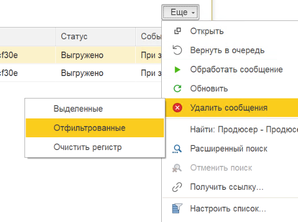

# Обслуживание очередей

Записи локальных очередей — РС «Исходящие сообщения» и «Входящие сообщения» — удаляются двумя способами: автоматически по срокам хранения и вручную командами очистки.

## Автоматическая очистка по срокам хранения

Устаревшие записи удаляет регламентное задание в рамках операции очистки хранилища. Сроки хранения (в днях) настраиваются на вкладке **Kafka / Администрирование / Очереди** — отдельно по группам статусов: незавершённые, обработанные, отправленные, отменённые, ошибки обработки и отправки, а также срок хранения хэш-сумм для [идемпотентности](../examples/idempotency.md).

Специальные значения:

- **-1** — не удалять;
- **-2** — удалять сразу после выгрузки во [внешний логгер](../configuration/logging.md).

## Ручная очистка локальной очереди

Для тестирования и отладки записи очередей удаляются вручную — командами группы **Удалить сообщения** на формах списков **Kafka / Исходящие сообщения** и **Kafka / Входящие сообщения**:

| Команда | Что удаляет |
|---------|-------------|
| **Удалить выделенные** | Отмеченные в списке записи |
| **Удалить отфильтрованные** | Записи по текущим отборам списка — так выполняется очистка **по продюсеру** (исходящие) или **по консьюмеру** (входящие): установите отбор по соответствующему полю |
| **Очистить регистр** | **Все** записи регистра, без отборов |

{ loading=lazy }

Перед удалением показывается диалог подтверждения с количеством удаляемых записей («Удалить N сообщений?», для полной очистки — «Очистить все сообщения?»). Удаление выполняется фоновой операцией, порциями.

!!! warning "Только при остановленном обмене"
    Команды удаления доступны, когда интеграция **не работает**: включена блокировка интеграции **или** отключено регламентное задание, и нет активных потоков обработки. Иначе адаптер сообщит о недоступности ручной обработки — заблокируйте обмен на вкладке **Kafka / Администрирование / Фоновые задания**.

!!! warning "Права"
    Удаление записей требует права записи в регистры очередей — роль **кфкПолныеПрава** (администратор адаптера). Пользователям с ролью **кфкБазовыеПрава** очереди доступны только на просмотр. См. [Роли и права](../installation/roles.md).

Команды **не затрагивают** служебные регистры «Очередь потоков» и «Хэш-суммы сообщений» — они очищаются автоматически по своим срокам хранения.

## Смотрите также

- [Мониторинг очередей](monitoring.md) — контроль размера очередей.
- [Статусы сообщений](statuses.md) — ручные операции над записями.
- [Логирование](../configuration/logging.md) — внешний логгер как долговременная история обмена.
