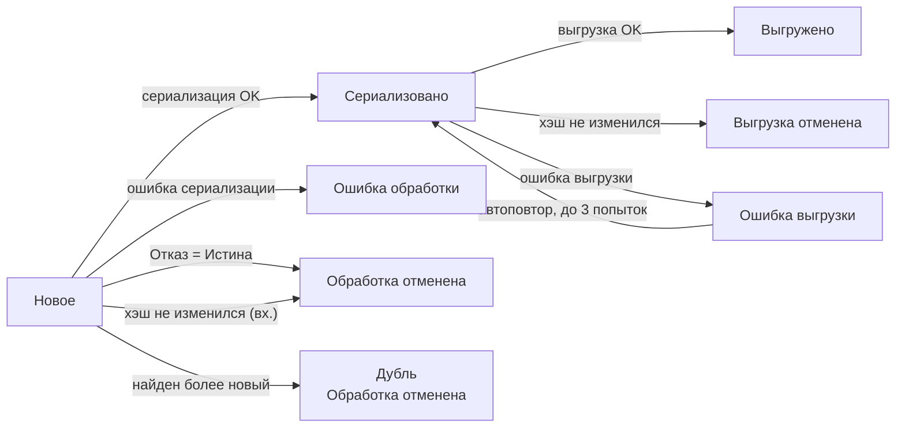

# Статусы сообщений

Полный перечень статусов в РС «Исходящие сообщения» и «Входящие сообщения».

## Основные статусы

| Статус | Применимость | Описание |
|--------|:---:|----------|
| **Новое** | исх. / вх. | Сообщение зарегистрировано или загружено, ожидает обработки |
| **Выгружено** | исх. | Успешно отправлено в Kafka |
| **Обработано** | исх. / вх. | Успешно обработано в 1С |
| **Ошибка выгрузки** | исх. | Ошибка при отправке в Kafka — сеть, брокер или исключение в обработчике продюсера |
| **Ошибка обработки** | исх. / вх. | Исключение в обработчике продюсера / консьюмера |
| **Выгрузка отменена** | исх. | Отправка отменена [идемпотентной отправкой](../configuration/producers.md#идемпотентная-отправка): содержимое не изменилось с прошлой выгрузки. Текст журнала — «Сообщение уже выгружено» |
| **Обработка отменена** | исх. / вх. | Обработка отменена через `Отказ = Истина` в обработчике, **или** дубль исходящего сообщения, **или** (для входящих) [идемпотентная обработка](../configuration/consumers.md#идемпотентная-обработка) — текст журнала «Сообщение уже обработано» |

## Переходы статусов

## Идемпотентность

Если у продюсера включена **Идемпотентная отправка**, а у консьюмера — **Идемпотентная обработка**, адаптер отсекает повторы с неизменным содержимым:

- **исходящее** сообщение, тело которого не изменилось с предыдущей выгрузки той же записи очереди, получает статус **«Выгрузка отменена»** с текстом «Сообщение уже выгружено» — в Kafka оно не уходит;
- **входящее** сообщение, тело которого не изменилось с предыдущей обработки той же записи очереди, получает статус **«Обработка отменена»** с текстом «Сообщение уже обработано» — обработчик не вызывается.

При изменении содержимого запись снова доступна для выгрузки/обработки. Подробности и способы форсировать повтор — [Идемпотентность](../examples/idempotency.md).

## Автоматический повтор

!!! warning "Автоповтор только для «Ошибка выгрузки»"
    При статусе `ОшибкаВыгрузки` система автоматически повторяет отправку — **не более 3 раз**, с интервалом равным расписанию регламентного задания.

    Поле **«Кол-во выгрузок»** отражает число уже выполненных попыток. После **3 неуспешных** попыток (а также при статусе `ОшибкаОбработки`) повторная обработка запускается **вручную** — выделите нужные записи и нажмите **Вернуть в очередь**.

## Дубли исходящих

Если один и тот же объект зарегистрирован **несколько раз** до выгрузки:

- В Kafka уйдёт только **последнее** состояние.
- Промежуточные версии получают статус **«Обработка отменена»** (причина — «Дубль»).

## Ручные операции в РС

Доступные команды над строками РС:

| Команда | Эффект |
|---------|--------|
| **Вернуть в очередь** | Переводит сообщение из ошибочного / отменённого / выгруженного статуса обратно в «Новое» для повторной обработки |
| **Пометить как дубль** | (для исходящих) Переводит в «Обработка отменена» с причиной «Дубль» |
| **Удалить сообщения** | Группа команд удаления записей очереди — выделенные, по отбору или весь регистр; см. [Обслуживание очередей](queue-maintenance.md) |

## Смотрите также

- [Диагностика](diagnostics.md) — где искать детали ошибки.
- [Типовые проблемы](troubleshooting.md).
