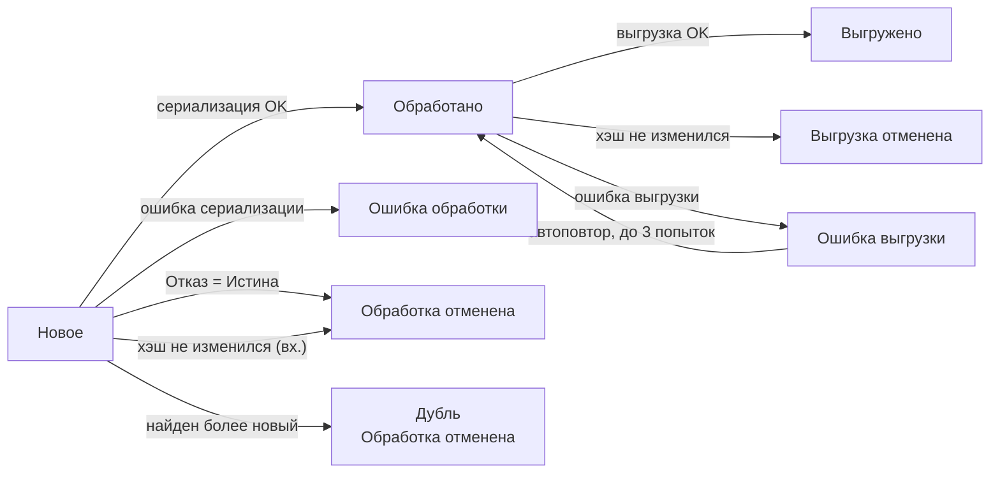

# Статусы сообщений

Полный перечень статусов в РС «Исходящие сообщения» и «Входящие сообщения».

## Основные статусы

| Статус | Применимость | Описание |
|--------|:---:|----------|
| **Новое** | исх. / вх. | Сообщение зарегистрировано или загружено, ожидает обработки |
| **Выгружено** | исх. | Успешно отправлено в Kafka |
| **Обработано** | исх. / вх. | Успешно обработано в 1С |
| **Ошибка выгрузки** | исх. | Ошибка при отправке в Kafka — сеть, брокер или ошибка транспортного этапа |
| **Ошибка обработки** | исх. / вх. | Исключение в обработчике продюсера / консьюмера |
| **Выгрузка отменена** | исх. | Отправка отменена [идемпотентной отправкой](../configuration/producers.md#идемпотентная-отправка): содержимое не изменилось с прошлой выгрузки. Текст журнала — «Сообщение уже выгружено» |
| **Обработка отменена** | исх. / вх. | Обработка отменена через `Отказ = Истина` в обработчике, **или** дубль исходящего сообщения, **или** (для входящих) [идемпотентная обработка](../configuration/consumers.md#идемпотентная-обработка) — текст журнала «Сообщение уже обработано» |

## Переходы статусов

```mermaid
flowchart LR
    N[Новое] -->|сериализация OK| S[Обработано]
    S -->|выгрузка OK| V[Выгружено]
    S -->|хэш не изменился| VC[Выгрузка отменена]
    S -->|ошибка выгрузки| EV[Ошибка выгрузки]
    EV -->|автоповтор, до 3 попыток| S
    N -->|ошибка сериализации| EO[Ошибка обработки]
    N -->|Отказ = Истина| OC[Обработка отменена]
    N -->|найден более новый| D[Дубль<br/>Обработка отменена]
    N -->|"хэш не изменился (вх.)"| OC
```

## Идемпотентность

Если у продюсера включена **Идемпотентная отправка**, а у консьюмера — **Идемпотентная обработка**, адаптер отсекает повторы с неизменным содержимым:

- **исходящее** сообщение, тело которого не изменилось с последней успешной выгрузки по тому же `КлючЗаписи`, получает статус **«Выгрузка отменена»** с текстом «Сообщение уже выгружено» — в Kafka оно не уходит;
- **входящее** сообщение, тело которого не изменилось с последней успешной обработки по тому же `КлючЗаписи`, получает статус **«Обработка отменена»** с текстом «Сообщение уже обработано» — обработчик не вызывается.

При изменении содержимого запись снова доступна для выгрузки/обработки. Подробности и способы форсировать повтор — [Идемпотентность](../examples/idempotency.md).

## Автоматический повтор

!!! warning "Автоповтор только для «Ошибка выгрузки»"
    При статусе `ОшибкаВыгрузки` система выполняет **всего не более 3 попыток отправки, включая первоначальную**, с интервалом равным расписанию регламентного задания.

    Поле **«Кол-во выгрузок»** отражает число уже выполненных попыток. После **3 неуспешных** попыток (а также при статусе `ОшибкаОбработки`) повторная обработка запускается **вручную** — выделите нужные записи и нажмите **Вернуть в очередь**.

## Дубли исходящих

По умолчанию для одного `КлючЗаписи` к сериализации и отправке допускается только последняя регистрация. Автоматическая очистка переводит старые регистрации в статус **«Обработка отменена»** с журналом «Дублирует позднюю регистрацию.». В очистку входят статусы **Новое**, **Обработано**, **Ошибка обработки** и **Ошибка выгрузки**; более новая регистрация учитывается независимо от её статуса. Ключи, назначенные потокам, исключаются из очистки. Записи без указанного продюсера автоматическая очистка дублей не затрагивает.

Если у продюсера включён флаг [**Отключить дедупликацию**](../configuration/producers.md#дедупликация-регистраций), его старые регистрации защищены от автоматической отмены во всех четырёх статусах. Несколько регистраций ключа допускаются к сериализации для **Новое** и к отправке для **Обработано**, в пределах текущего указателя и остальных условий. Ошибочные записи обрабатываются по прежним правилам повторов. Идемпотентная отправка независимо может отменить выгрузку одинакового тела; ручная команда **Пометить как дубль** сохраняет действие.

## Ручные операции в РС

Доступные команды над строками РС:

| Команда | Эффект |
|---------|--------|
| **Вернуть в очередь** | Переводит сообщение из ошибочного / отменённого / выгруженного статуса обратно в «Новое» для повторной обработки |
| **Пометить как дубль** | (для исходящих) Переводит в «Обработка отменена» с причиной «Дубль» |
| **Удалить сообщения** | Группа команд удаления записей очереди — выделенные, по отбору или весь регистр; см. [Обслуживание очередей](queue-maintenance.md) |

## Смотрите также

- [Диагностика](diagnostics.md) — где искать детали ошибки.
- [Типовые проблемы](troubleshooting.md).
